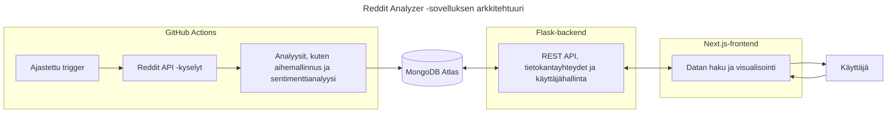

# Seminaarityö: Flask-backendin testausta

Tässä seminaarityössä tutustun Flask-backendin testaukseen osana Ohjelmistoprojekti 2 -kurssin projektiani ([Reddit Analyzer](https://github.com/ohjelmistoprojekti-ii-reddit-app)).

**Sisällysluettelo**:
- [Johdanto](#johdanto)
- [Testauksen perusteet](#testauksen-perusteet)
- [Testauksen suunnittelu](#testauksen-suunnittelu)
- [Lähteet](#lähteet)
- [Tekoälyn käyttö](#tekoälyn-käyttö-työn-toteutuksessa)

## Johdanto

Valitsin seminaarityöni aiheeksi **testauksen**, koska se on arvostettu taito työelämässä ja ohjelmistokehityksen osa-alue, jossa haluan kehittyä. Aiempi kokemukseni koostuu pääasiassa yksittäisten testien kirjoittamisesta, enkä ole koskaan toteuttanut testausta osana laajempaa kehitysprosessia. Käynnissä oleva **Ohjelmistoprojekti 2** -kurssi tarjoaa tähän erinomaisen mahdollisuuden: olen mukana kehittämässä **Reddit Analyzer** -sovellusta, ja projekti on edennyt jo viimeiseen sprinttiin ilman, että sovellusta olisi vielä testattu lainkaan.

Lähes valmis projekti tarjoaa kiinnostavat ja osin haastavatkin lähtökohdat testaamiselle. Kehityksen loppuvaiheessa ja julkaisun lähestyessä on erityisen tärkeää varmistaa sovelluksen toimivuus ja laatu. Odotan mielenkiinnolla, kuinka testattavaa nykyinen koodi on ja millaisia kehityskohteita testaus tuo esiin.

Minulle tämä seminaarityö on paitsi uusien testausmenetelmien ja -työkalujen opettelua, myös laadullinen tutkimus projektistamme. 

### Projektin tausta

**Reddit Analyzer** on web-sovellus, joka kerää ja analysoi Redditissä käytyjä keskusteluja tunnistaen niistä keskeisiä trendejä ja teemoja sekä keskustelujen sävyjä. Analyysit, kuten aihemallinnus ja sentimenttianalyysi, on toteutettu valmiita malleja (esim. BERTopic, VADER) hyödyntäen, ja ne on automatisoitu **GitHub Actions**in avulla. Tulokset tallennetaan `MongoDB Atlas` -tietokantaan, josta ne tarjoillaan käyttäjälle `Flask`-backendin REST-rajapinnan kautta. `Next.js`-pohjainen frontend esittää analyysien tulokset visuaalisessa muodossa, esimerkiksi kaavioina ja karttanäkymänä.

Arkkitehtuurikaavio havainnollistaa, miten sovelluksen eri osat liittyvät toisiinsa ja mitä niiden vastuualueisiin kuuluu. Analyysiputket on eroteltu omaksi kokonaisuudekseen, koska ne ajetaan **GitHub Actions** -ympäristössä GitHubin virtuaalikoneilla, eivätkä siten kuulu Flask-backendin suoritusympäristöön. Backendin keskeiset osa-alueet ovat **REST-rajapinta, tietokantayhteydet ja käyttäjähallinta**, kun taas frontend vastaa datan visualisoinnista ja käyttäjän vuorovaikutuksesta sovelluksen kanssa.

Reddit Analyzer on kehitetty viisihenkisessä tiimissä ketterien menetelmien mukaisesti. Oma roolini on painottunut backendin kehitykseen: olen vastannut muun muassa analyysiputkien suunnittelusta ja automatisoinnista sekä tilaustoiminnon toteutuksesta. 

### Seminaarityön tavoitteet

Tässä seminaarityössä keskityn **backend-testaukseen**, koska se tarjoaa monipuolisia oppimiskokemuksia ja mahdollisuuden syventyä teknisesti haastaviin osa-alueisiin. **Reddit Analyzerin** backendissa hallinnoidaan muun muassa token-perusteista autentikaatiota ja tietokantayhteyksiä, joiden testaamisesta minulla ei ole aiempaa kokemusta. Myös Python-pohjaisen sovelluksen testaaminen on minulle uutta, mikä tekee aiheesta erityisen opettavaisen.

Tavoitteeni on suunnitella ja toteuttaa testausprosessi selkeästi ja systemaattisesti. **Allure Report** otetaan käyttöön heti alkuvaiheessa, jotta testausprosessin eteneminen ja tulosten analysointi olisi läpinäkyvää ja helposti seurattavaa.

Testauksen automatisointi **GitHub Actions** -ympäristössä on valinnainen lisä: se olisi oppimisen kannalta arvokasta, mutta en pidä sitä välttämättömänä, koska projekti on jo loppusuoralla. Automatisoiduista testeistä olisi ollut eniten hyötyä projektin aikaisemmissa vaiheissa, jolloin ne olisivat toimineet kehityksen jatkuvana tukena. Tässä vaiheessa testauksen ensisijainen tavoite on varmistaa sovelluksen toimivuus ja vakaus ennen julkaisua.

Seminaarityössä keskityn seuraaviin osa-alueisiin:
1. Testauksen suunnittelu
2. Testien toteuttaminen
3. Testitulosten visualisointi **Allure Report** -työkalulla
4. Testitulosten analysointi ja hyödyntäminen ohjelmiston laadun arvioinnissa
5. Testauksen automatisointi **GitHub Actions** -ympäristössä (jos aikaa jää)

Näin työ toimii paitsi käytännön oppimiskokemuksena myös osana projektin laadunvarmistusta.

### Suunnitellut teknologiat

- **Flask** - kevyt Python-pohjainen web-kehys, jota on käytetty Reddit Analyzerin backendin toteutukseen
- **Pytest** - Pythonin suosittu testauskehys, joka tukee yksikkö-, integraatio- ja järjestelmätason testejä
- **Mongomock** - kirjasto, joka simuloi MongoDB:n toimintaa ja mahdollistaa tietokantaoperaatioiden testaamisen ilman oikeaa tietokantayhteyttä
- **GitHub Actions** - GitHubin sisäänrakennettu CI/CD-ympäristö, jonka avulla testit ja muut työnkulut voidaan ajaa automaattisesti koodimuutosten yhteydessä tai esimerkiksi ajastettuna
- **Allure Report** - työkalu, joka visualisoi testitulokset vuorovaikutteisena HTML-sivuna ja tarjoaa kokonaiskuvan testien tuloksista, kattavuudesta ja kehityksestä ajan myötä

## Testauksen perusteet

Ennen testauksen suunnittelua haluan kerrata lyhyesti keskeiset testauksen periaatteet ja käsitteet. Teoriapohjana hyödynnän Jussi Pekka Kasurisen kirjaa *Ohjelmistotestauksen käsikirja*, johon tutustuin Haaga-Helian Ohjelmistotestauksen kurssilla tänä syksynä.

### Testauksen merkitys

Testaus on keskeinen osa ohjelmistokehitystä, ja sen tarkoituksena on varmistaa, että ohjelmisto **toimii suunnitellusti** ja **täyttää** käyttäjien sekä sidosryhmien **vaatimukset**. Testauksen avulla voidaan havaita vikoja ja puutteita, jotka muuten saattaisivat johtaa ohjelmiston epätoivottuun toimintaan. (Kasurinen, luku 1)

### Testauksen tasot

Kasurisen kirjan (luku 3) mukaan testauksessa voidaan erottaa useita tasoja, jotka kattavat ohjelmiston eri osa-alueita ja tarjoavat eri näkökulmia laadunvarmistukseen.

**Yksikkötestaus** kohdistuu yksittäisen moduulin, funktion tai olion toiminnan varmentamiseen. Testeillä voidaan tarkistaa esimerkiksi erilaisten syötteiden käsittely, raja-arvot ja poikkeustilanteiden hallinta.

**Integraatiotestaus** tarkastelee ohjelmiston eri osien yhteistoimintaa. Sen avulla varmistetaan, että eri moduulit ja rajapinnat kommunikoivat oikein keskenään.

**Järjestelmätestaus** kohdistuu koko järjestelmään, ja sen tarkoituksena on varmistaa, että ohjelmisto toimii kokonaisuutena ja täyttää sille asetetut vaatimukset.

### Testauksen suunnittelu

Kasurisen kirjassa (s. 117-118) kuvataan esimerkkinä **SPACE DIRT** -menetelmän mukaisen **testaussuunnitelman** vaiheet:
- **S**cope - laajuus: mitä kohteita testataan ja mitä osia ei testata
- **P**eople - ihmiset: millaista koulutusta testaajilta vaaditaan, mitkä ovat testaajien vastuut
- **A**pproach - lähestymistapa: mitä testausmenetelmiä käytetään
- **C**riteria - kriteerit: mitkä ovat testauksen aloitus-, lopetus-, keskeytys- ja jatkamiskriteerit
- **E**nvironment - ympäristö: millainen testiympäristö testausta varten tulee rakentaa
- **D**eliverables - tuotokset: mitä testausprosessi tuottaa kehitysprosessin käyttöön
- **I**ncidentals - satunnaiset: mitä erikoisominaisuuksia tai poikkeuksia testaukseen liittyy
- **R**isks - riskit: riskit ja niiden torjunta
- **T**asks - tehtävät: tehtävät, jotka kuuluvat testausprosessiin

Testaussuunnitelman sisältö voi vaihdella projektin ja tilanteen mukaan, joten SPACE DIRT on vain yksi esimerkki. SPACE DIRT ja muut standardien mukaiset testaussuunnitelman sopivat kenties parhaiten suuriin projekteihin - pienemmässä projektissa niitä voi soveltaa poimimalla mukaan oman projektin kannalta keskeiset osa-alueet. Yleensä testaussuunnitelmassa kirjataan ainakin mitä ohjelmasta testataan, missä vaiheessa ja millä menetelmällä (Kasurinen, s.116).

### Testitapaukset

Testaussuunnitelman jälkeen suunnitellaan **testitapaukset**, jotka kuvaavat yksittäisiä työvaiheita tai tapahtumaketjuja, joiden seurauksena järjestelmä suorittaa jonkin tehtävän. Kuvauksessa voidaan mainita esimerkiksi testin vaiheet ja odotettu lopputulos ja mitä testillä halutaan varmistaa.

Hyvien käytäntöjen mukaan testitapauksia tulisi määritellä koko projektin elinkaaren ajan, aina kun tulee uusia ominaisuuksia tai kun havaitaan jokin vika tai ongelma. Testitapaukset kannattaa kohdistaa tunnetusti virhealttiisiin ohjelmiston osiin, kuten uuteen koodiin, ominaisuuteen tai teknologiaan. Testitapauksia voi syntyä paljon, jolloin niitä joudutaan priorisoimaan esimerkiksi **riskikartoituksen** avulla. (Kasurinen, s. 118-121)

Kasurisen (s. 122-123) mukaan testitapausten valintaan on kaksi päämenetelmää:
- **Suunnitelmalähtöinen testitapausten valinta**: pyritään kattamaan kaikki ohjelmistolle asetetut laatuvaatimukset mahdollisimman kustannustehokkaasti
- **Riskilähtöinen testitapausten valinta**: keskitytään poistamaan isoimmat ongelmat ja varmistamaan pääominaisuuksien toiminta

### Projektikohtainen pohdinta

Omassa projektissani vaatimusten täyttymisen todentaminen on osittain haasteellista, koska kunnollista vaatimusmäärittelyä ei ole laadittu. Meillä on vain lista käyttäjätarinoita, jotka olemme purkaneet konkreettisiksi tehtäviksi projektitaulussa.

Tämän vuoksi testauksen painopiste on erityisesti sovelluksen **keskeisten toimintojen toimivuuden varmistamisessa ja vikojen löytämisessä**. Samalla testaus toimii välineenä arvioida ratkaisujen ja koodin laatua käytännössä.

Pääpaino tulee olemaan yksikkö- ja integraatiotestauksessa, koska ne sopivat parhaiten projektin laajuuteen ja resursseihin. Järjestelmätestaus, ainakin Kasurisen kirjan määritelmän mukaisesti, olisi vaikea toteuttaa puutteellisten vaatimusmäärittelyjen takiai.

Projektin kokoon ja aikatauluun nähden täysimittainen SPACE DIRT -testaussuunnitelma olisi ylimitoitettu, kuten monet muutkin standardoidut mallit. Käytän sitä kuitenkin inspiraationa oman, kevyemmän testaussuunnitelman laatimisessa, joka keskittyy sovelluksen tärkeimpiin osiin ja riskilähtöiseen priorisointiin.

Näin pystyn yhdistämään teoreettisen viitekehyksen ja käytännön tarpeet tarkoituksenmukaisella tavalla.

## Testaussuunnitelma

## Lähteet
- https://flask.palletsprojects.com/en/stable/testing/
- https://docs.pytest.org/en/stable/
- https://github.com/mongomock/mongomock
- https://docs.github.com/en/actions
- https://allurereport.org/docs/
- Kasurinen, J. 2013. Ohjelmistotestauksen käsikirja. 1. painos. Docendo. Jyväskylä.

## Tekoälyn käyttö työn toteutuksessa

Olen hyödyntänyt tekoälyä, kuten ChatGPT:tä, tekstien muotoilun apuna. Kirjoitan ensin kappaleen itse ja tarvittaessa pyydän tekoälyä ehdottamaan vaihtoehtoisia muotoiluja, joista sitten yhdistän osia omaan tekstiini. Sisällön olen kuitenkin tuottanut itse, enkä käytä tekoälyä tekstin suoraan generointiin.
