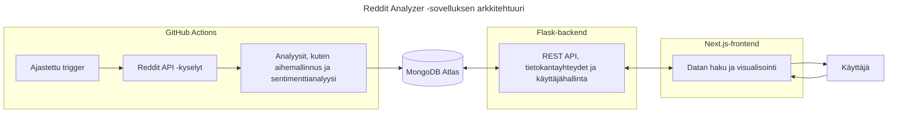

# Seminaarityö: Flask-backendin testausta

Tässä seminaarityössä tutustun Flask-backendin testaukseen osana Ohjelmistoprojekti 2 -kurssin projektiani ([Reddit Analyzer](https://github.com/ohjelmistoprojekti-ii-reddit-app)).

**Sisällysluettelo**:
- [Johdanto](#johdanto)
- [Lähteet](#lähteet)
- [Tekoälyn käyttö](#tekoälyn-käyttö-työn-toteutuksessa)

## Johdanto

Valitsin seminaarityöni aiheeksi **testauksen**, koska se on arvostettu taito työelämässä ja ohjelmistokehityksen osa-alue, jossa haluan kehittyä. Aiempi kokemukseni koostuu pääasiassa yksittäisten testien kirjoittamisesta, enkä ole koskaan toteuttanut testausta osana laajempaa kehitysprosessia. Käynnissä oleva **Ohjelmistoprojekti 2** -kurssi tarjoaa tähän erinomaisen mahdollisuuden: olen mukana kehittämässä **Reddit Analyzer** -sovellusta, ja projekti on edennyt jo viimeiseen sprinttiin ilman, että sovellusta olisi vielä testattu lainkaan.

Lähes valmis projekti tarjoaa kiinnostavat ja osin haastavatkin lähtökohdat testaamiselle. Kehityksen loppuvaiheessa ja julkaisun lähestyessä on erityisen tärkeää varmistaa sovelluksen toimivuus ja laatu. Odotan mielenkiinnolla, kuinka testattavaa nykyinen koodi on ja millaisia kehityskohteita testaus tuo esiin.

Minulle tämä seminaarityö on paitsi uusien testausmenetelmien ja -työkalujen opettelua, myös laadullinen tutkimus projektistamme. 

### Projektin tausta

**Reddit Analyzer** on web-sovellus, joka kerää ja analysoi Redditissä käytyjä keskusteluja tunnistaen niistä keskeisiä trendejä ja teemoja sekä keskustelujen sävyjä. Analyysit, kuten aihemallinnus ja sentimenttianalyysi, on toteutettu valmiita malleja (esim. BERTopic, VADER) hyödyntäen, ja ne on automatisoitu **GitHub Actions**in avulla. Tulokset tallennetaan `MongoDB Atlas` -tietokantaan, josta ne tarjoillaan käyttäjälle `Flask`-backendin REST-rajapinnan kautta. `Next.js`-pohjainen frontend esittää analyysien tulokset visuaalisessa muodossa, esimerkiksi kaavioina ja karttanäkymänä.

Arkkitehtuurikaavio havainnollistaa, miten sovelluksen eri osat liittyvät toisiinsa ja mitä niiden vastuualueisiin kuuluu. Analyysiputket on eroteltu omaksi kokonaisuudekseen, koska ne ajetaan **GitHub Actions** -ympäristössä GitHubin virtuaalikoneilla, eivätkä siten kuulu Flask-backendin suoritusympäristöön. Backendin keskeiset osa-alueet ovat **REST-rajapinta, tietokantayhteydet ja käyttäjähallinta**, kun taas frontend vastaa datan visualisoinnista ja käyttäjän vuorovaikutuksesta sovelluksen kanssa.

Reddit Analyzer on kehitetty viisihenkisessä tiimissä ketterien menetelmien mukaisesti. Oma roolini on painottunut backendin kehitykseen: olen vastannut muun muassa analyysiputkien suunnittelusta ja automatisoinnista sekä tilaustoiminnon toteutuksesta. 

### Seminaarityön tavoitteet

Tässä seminaarityössä keskityn **backend-testaukseen**, koska se tarjoaa monipuolisia oppimiskokemuksia ja mahdollisuuden syventyä teknisesti haastaviin osa-alueisiin. **Reddit Analyzerin** backendissa hallinnoidaan muun muassa token-perusteista autentikaatiota ja tietokantayhteyksiä, joiden testaamisesta minulla ei ole aiempaa kokemusta. Myös Python-pohjaisen sovelluksen testaaminen on minulle uutta, mikä tekee aiheesta erityisen opettavaisen.

Tavoitteeni on suunnitella ja toteuttaa testausprosessi selkeästi ja systemaattisesti. **Allure Report** otetaan käyttöön heti alkuvaiheessa, jotta testausprosessin eteneminen ja tulosten analysointi olisi läpinäkyvää ja helposti seurattavaa.

Testauksen automatisointi **GitHub Actions** -ympäristössä on valinnainen lisä: se olisi oppimisen kannalta arvokasta, mutta en pidä sitä välttämättömänä, koska projekti on jo loppusuoralla. Automatisoiduista testeistä olisi ollut eniten hyötyä projektin aikaisemmissa vaiheissa, jolloin ne olisivat toimineet kehityksen jatkuvana tukena. Tässä vaiheessa testauksen ensisijainen tavoite on varmistaa sovelluksen toimivuus ja vakaus ennen julkaisua.

Seminaarityössä keskityn seuraaviin osa-alueisiin:
1. Testauksen suunnittelu
2. Testien toteuttaminen
3. Testitulosten visualisointi **Allure Report** -työkalulla
4. Testitulosten analysointi ja hyödyntäminen ohjelmiston laadun arvioinnissa
5. Testauksen automatisointi **GitHub Actions** -ympäristössä (jos aikaa jää)

Näin työ toimii paitsi käytännön oppimiskokemuksena myös osana projektin laadunvarmistusta.

### Suunnitellut teknologiat

- **Flask** - kevyt Python-pohjainen web-kehys, jota on käytetty Reddit Analyzerin backendin toteutukseen
- **Pytest** - Pythonin suosittu testauskehys, joka tukee yksikkö-, integraatio- ja järjestelmätason testejä
- **Mongomock** - kirjasto, joka simuloi MongoDB:n toimintaa ja mahdollistaa tietokantaoperaatioiden testaamisen ilman oikeaa tietokantayhteyttä
- **GitHub Actions** - GitHubin sisäänrakennettu CI/CD-ympäristö, jonka avulla testit ja muut työnkulut voidaan ajaa automaattisesti koodimuutosten yhteydessä tai esimerkiksi ajastettuna
- **Allure Report** - työkalu, joka visualisoi testitulokset vuorovaikutteisena HTML-sivuna ja tarjoaa kokonaiskuvan testien tuloksista, kattavuudesta ja kehityksestä ajan myötä

## Lähteet
- https://flask.palletsprojects.com/en/stable/testing/
- https://docs.pytest.org/en/stable/
- https://github.com/mongomock/mongomock
- https://docs.github.com/en/actions
- https://allurereport.org/docs/

## Tekoälyn käyttö työn toteutuksessa

Olen hyödyntänyt tekoälyä, kuten ChatGPT:tä, tekstien muotoilun apuna. Kirjoitan ensin kappaleen itse ja tarvittaessa pyydän tekoälyä ehdottamaan vaihtoehtoisia muotoiluja, joista sitten yhdistän osia omaan tekstiini. Sisällön olen kuitenkin tuottanut itse, enkä käytä tekoälyä tekstin suoraan generointiin.
