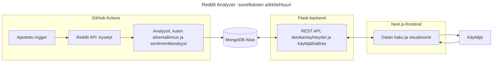

# Seminaarityö: Flask-backendin testausta

Tässä seminaarityössä tutustun Flask-backendin testaukseen osana Ohjelmistoprojekti 2 -kurssin projektiani ([Reddit Analyzer](https://github.com/ohjelmistoprojekti-ii-reddit-app)).

**Sisällysluettelo**:
- [Johdanto](#johdanto)
  - [Projektin tausta](#projektin-tausta)
  - [Seminaarityön tavoitteet](#seminaarityön-tavoitteet)
  - [Suunnitellut teknologiat](#suunnitellut-teknologiat)
- [Testauksen perusteet](#testauksen-perusteet)
  - [Testauksen merkitys](#testauksen-merkitys)
  - [Testauksen tasot](#testauksen-tasot)
  - [Testauksen suunnittelu](#testauksen-suunnittelu)
  - [Testitapausten suunnittelu](#testitapausten-suunnittelu)
  - [Pohdinta](#projektikohtainen-pohdinta)
- [Testaussuunnitelma](#testauksen-suunnittelu)
  - [Testauksen tavoite ja laajuus](#testauksen-tavoite-ja-laajuus)
  - [Testauksen lähestymistapa](#testauksen-lähestymistapa)
  - [Testauksen kriteerit](#testauksen-kriteerit)
  - [Testiympäristö](#testiympäristö)
  - [Testien priorisointi](#testien-priorisointi)
  - [Testauksen tuotokset](#testauksen-tuotokset)
- [Lähteet](#lähteet)
- [Tekoälyn käyttö](#tekoälyn-käyttö-työn-toteutuksessa)

## Johdanto

Valitsin seminaarityöni aiheeksi **testauksen**, koska se on arvostettu taito työelämässä ja ohjelmistokehityksen osa-alue, jossa haluan kehittyä. Aiempi kokemukseni koostuu pääasiassa yksittäisten testien kirjoittamisesta, enkä ole koskaan toteuttanut testausta osana laajempaa kehitysprosessia. Käynnissä oleva **Ohjelmistoprojekti 2** -kurssi tarjoaa tähän erinomaisen mahdollisuuden: olen mukana kehittämässä **Reddit Analyzer** -sovellusta, ja projekti on edennyt jo viimeiseen sprinttiin ilman, että sovellusta olisi vielä testattu lainkaan.

Lähes valmis projekti tarjoaa kiinnostavat ja osin haastavatkin lähtökohdat testaamiselle. Kehityksen loppuvaiheessa ja julkaisun lähestyessä on erityisen tärkeää varmistaa sovelluksen toimivuus ja laatu. Odotan mielenkiinnolla, kuinka testattavaa nykyinen koodi on ja millaisia kehityskohteita testaus tuo esiin.

Minulle tämä seminaarityö on paitsi uusien testausmenetelmien ja -työkalujen opettelua, myös laadullinen tutkimus projektistamme. 

### Projektin tausta

**Reddit Analyzer** on web-sovellus, joka kerää ja analysoi Redditissä käytyjä keskusteluja tunnistaen niistä keskeisiä trendejä ja teemoja sekä keskustelujen sävyjä. Analyysit, kuten aihemallinnus ja sentimenttianalyysi, on toteutettu valmiita malleja (esim. BERTopic, VADER) hyödyntäen, ja ne on automatisoitu **GitHub Actions**in avulla. Tulokset tallennetaan `MongoDB Atlas` -tietokantaan, josta ne tarjoillaan käyttäjälle `Flask`-backendin REST-rajapinnan kautta. `Next.js`-pohjainen frontend esittää analyysien tulokset visuaalisessa muodossa, esimerkiksi kaavioina ja karttanäkymänä.

Arkkitehtuurikaavio havainnollistaa, miten sovelluksen eri osat liittyvät toisiinsa ja mitä niiden vastuualueisiin kuuluu. Analyysiputket on eroteltu omaksi kokonaisuudekseen, koska ne ajetaan **GitHub Actions** -ympäristössä GitHubin virtuaalikoneilla, eivätkä siten kuulu Flask-backendin suoritusympäristöön. Backendin keskeiset osa-alueet ovat **REST-rajapinta, tietokantayhteydet ja käyttäjähallinta**, kun taas frontend vastaa datan visualisoinnista ja käyttäjän vuorovaikutuksesta sovelluksen kanssa.

Reddit Analyzer on kehitetty viisihenkisessä tiimissä ketterien menetelmien mukaisesti. Oma roolini on painottunut backendin kehitykseen: olen vastannut muun muassa analyysiputkien suunnittelusta ja automatisoinnista sekä tilaustoiminnon toteutuksesta. 

### Seminaarityön tavoitteet

Tässä seminaarityössä keskityn **backend-testaukseen**, koska se tarjoaa monipuolisia oppimiskokemuksia ja mahdollisuuden syventyä teknisesti haastaviin osa-alueisiin. **Reddit Analyzerin** backendissa hallinnoidaan muun muassa token-perusteista autentikaatiota ja tietokantayhteyksiä, joiden testaamisesta minulla ei ole aiempaa kokemusta. Myös Python-pohjaisen sovelluksen testaaminen on minulle uutta, mikä tekee aiheesta erityisen opettavaisen.

Tavoitteeni on suunnitella ja toteuttaa testausprosessi selkeästi ja systemaattisesti. **Allure Report** otetaan käyttöön heti alkuvaiheessa, jotta testausprosessin eteneminen ja tulosten analysointi olisi läpinäkyvää ja helposti seurattavaa.

Testauksen automatisointi **GitHub Actions** -ympäristössä on valinnainen lisä: se olisi oppimisen kannalta arvokasta, mutta en pidä sitä välttämättömänä, koska projekti on jo loppusuoralla. Automatisoiduista testeistä olisi ollut eniten hyötyä projektin aikaisemmissa vaiheissa, jolloin ne olisivat toimineet kehityksen jatkuvana tukena. Tässä vaiheessa testauksen ensisijainen tavoite on varmistaa sovelluksen toimivuus ja vakaus ennen julkaisua.

Seminaarityössä keskityn seuraaviin osa-alueisiin:
1. Testauksen suunnittelu
2. Testien toteuttaminen
3. Testitulosten visualisointi **Allure Report** -työkalulla
4. Testitulosten analysointi ja hyödyntäminen ohjelmiston laadun arvioinnissa
5. Testauksen automatisointi **GitHub Actions** -ympäristössä (jos aikaa jää)

Näin työ toimii paitsi käytännön oppimiskokemuksena myös osana projektin laadunvarmistusta.

### Suunnitellut teknologiat

- **Flask** - kevyt Python-pohjainen web-kehys, jota on käytetty Reddit Analyzerin backendin toteutukseen
- **Pytest** - Pythonin suosittu testauskehys, joka tukee yksikkö-, integraatio- ja järjestelmätason testejä
- **Mongomock** - kirjasto, joka simuloi MongoDB:n toimintaa ja mahdollistaa tietokantaoperaatioiden testaamisen ilman oikeaa tietokantayhteyttä
- **GitHub Actions** - GitHubin sisäänrakennettu CI/CD-ympäristö, jonka avulla testit ja muut työnkulut voidaan ajaa automaattisesti koodimuutosten yhteydessä tai esimerkiksi ajastettuna
- **Allure Report** - työkalu, joka visualisoi testitulokset vuorovaikutteisena HTML-sivuna ja tarjoaa kokonaiskuvan testien tuloksista, kattavuudesta ja kehityksestä ajan myötä

## Testauksen perusteet

Ennen testauksen suunnittelua haluan kerrata lyhyesti keskeiset testauksen periaatteet ja käsitteet. Teoriapohjana hyödynnän Jussi Pekka Kasurisen kirjaa *Ohjelmistotestauksen käsikirja*, johon tutustuin Haaga-Helian Ohjelmistotestauksen kurssilla tänä syksynä.

### Testauksen merkitys

Testaus on keskeinen osa ohjelmistokehitystä, ja sen tarkoituksena on varmistaa, että ohjelmisto **toimii suunnitellusti** ja **täyttää** käyttäjien sekä sidosryhmien **vaatimukset**. Testauksen avulla voidaan havaita vikoja ja puutteita, jotka muuten saattaisivat johtaa ohjelmiston epätoivottuun toimintaan. (Kasurinen, luku 1)

### Testauksen tasot

Kasurisen kirjan (luku 3) mukaan testauksessa voidaan erottaa useita tasoja, jotka kattavat ohjelmiston eri osa-alueita ja tarjoavat eri näkökulmia laadunvarmistukseen.

**Yksikkötestaus** kohdistuu yksittäisen moduulin, funktion tai olion toiminnan varmentamiseen. Testeillä voidaan tarkistaa esimerkiksi erilaisten syötteiden käsittely, raja-arvot ja poikkeustilanteiden hallinta.

**Integraatiotestaus** tarkastelee ohjelmiston eri osien yhteistoimintaa. Sen avulla varmistetaan, että eri moduulit ja rajapinnat kommunikoivat oikein keskenään.

**Järjestelmätestaus** kohdistuu koko järjestelmään, ja sen tarkoituksena on varmistaa, että ohjelmisto toimii kokonaisuutena ja täyttää sille asetetut vaatimukset.

### Testauksen suunnittelu

Kasurisen kirjassa (s. 117-118) kuvataan esimerkkinä **SPACE DIRT** -menetelmän mukaisen **testaussuunnitelman** vaiheet:
- **S**cope - laajuus: mitä kohteita testataan ja mitä osia ei testata
- **P**eople - ihmiset: millaista koulutusta testaajilta vaaditaan, mitkä ovat testaajien vastuut
- **A**pproach - lähestymistapa: mitä testausmenetelmiä käytetään
- **C**riteria - kriteerit: mitkä ovat testauksen aloitus-, lopetus-, keskeytys- ja jatkamiskriteerit
- **E**nvironment - ympäristö: millainen testiympäristö testausta varten tulee rakentaa
- **D**eliverables - tuotokset: mitä testausprosessi tuottaa kehitysprosessin käyttöön
- **I**ncidentals - satunnaiset: mitä erikoisominaisuuksia tai poikkeuksia testaukseen liittyy
- **R**isks - riskit: riskit ja niiden torjunta
- **T**asks - tehtävät: tehtävät, jotka kuuluvat testausprosessiin

Testaussuunnitelman sisältö voi vaihdella projektin ja tilanteen mukaan, joten SPACE DIRT on vain yksi esimerkki. SPACE DIRT ja muut standardien mukaiset testaussuunnitelman sopivat kenties parhaiten suuriin projekteihin - pienemmässä projektissa niitä voi soveltaa poimimalla mukaan oman projektin kannalta keskeiset osa-alueet. Yleensä testaussuunnitelmassa kirjataan ainakin mitä ohjelmasta testataan, missä vaiheessa ja millä menetelmällä (Kasurinen, s.116).

### Testitapausten suunnittelu

Testaussuunnitelman jälkeen suunnitellaan **testitapaukset**, jotka kuvaavat yksittäisiä työvaiheita tai tapahtumaketjuja, joiden seurauksena järjestelmä suorittaa jonkin tehtävän. Kuvauksessa voidaan mainita esimerkiksi testin vaiheet ja odotettu lopputulos ja mitä testillä halutaan varmistaa.

Hyvien käytäntöjen mukaan testitapauksia tulisi määritellä koko projektin elinkaaren ajan, aina kun tulee uusia ominaisuuksia tai kun havaitaan jokin vika tai ongelma. Testitapaukset kannattaa kohdistaa tunnetusti virhealttiisiin ohjelmiston osiin, kuten uuteen koodiin, ominaisuuteen tai teknologiaan. Testitapauksia voi syntyä paljon, jolloin niitä joudutaan priorisoimaan esimerkiksi **riskikartoituksen** avulla. (Kasurinen, s. 118-121)

Kasurisen (s. 122-123) mukaan testitapausten valintaan on kaksi päämenetelmää:
- **Suunnitelmalähtöinen testitapausten valinta**: pyritään kattamaan kaikki ohjelmistolle asetetut laatuvaatimukset mahdollisimman kustannustehokkaasti
- **Riskilähtöinen testitapausten valinta**: keskitytään poistamaan isoimmat ongelmat ja varmistamaan pääominaisuuksien toiminta

### Projektikohtainen pohdinta

Omassa projektissani vaatimusten täyttymisen todentaminen on osittain haasteellista, koska kunnollista vaatimusmäärittelyä ei ole laadittu. Meillä on vain lista käyttäjätarinoita, jotka olemme purkaneet konkreettisiksi tehtäviksi projektitaulussa. Tämän vuoksi testauksen painopiste on erityisesti sovelluksen keskeisten toimintojen **toimivuuden varmistamisessa ja vikojen löytämisessä**. Samalla testaus toimii välineenä arvioida projektin laatua käytännössä.

Pääpaino tulee olemaan **yksikkö- ja integraatiotesteissä**, koska ne soveltuvat backendin REST-rajapinnan ja tietokantayhteyksien testaamiseen parhaiten. Järjestelmätestaus, ainakin Kasurisen kirjan määritelmän mukaisesti, olisi vaikea toteuttaa puutteellisten vaatimusmäärittelyjen sekä rajallisten resurssien vuoksi.

Projektin kokoon ja aikatauluun nähden täysimittainen SPACE DIRT -testaussuunnitelma olisi ylimitoitettu. Käytän sitä kuitenkin inspiraationa oman, kevyemmän testaussuunnitelman laatimisessa, joka keskittyy sovelluksen tärkeimpiin osiin ja riskilähtöiseen priorisointiin. Näin pystyn yhdistämään teorian ja käytännön tarpeet, ja testausprosessi pysyy selkeänä ja johdonmukaisena.

## Testaussuunnitelma

Testaussuunnitelma pohjautuu Kasurisen kuvaamiin testauksen periaatteisiin ja SPACE DIRT -malliin, jota on kevennetty Reddit Analyzer -projektiin sopivaksi.

### Testauksen tavoite ja laajuus

Testauksen tavoitteena on varmistaa backendin **keskeisten toimintojen toimivuus ja vakaus** ennen julkaisua. Lisäksi testit tukevat projektin **laadun arviointia**, esimerkiksi sovelluksen luotettavuuden ja mahdollisten vikojen kartoittamista, sekä paljastavat ratkaisujen **vahvuuksia ja puutteita**.

Testauksen kohteena ovat:
- **REST API** - vasteet, virheidenkäsittely ja raja-arvot
- **Tietokantayhteydet (MongoDB)** - CRUD-operaatiot ja datan eheys
- **Token-pohjainen käyttäjähallinta ja autentikointi** - rekisteröinti, kirjautuminen ja tokenien validointi

Testaus **ei kata** analyysiputkia, koska ne ajetaan erillisessä automatisoidussa ympäristössä (*GitHub Actions*) eivätkä siten kuulu backendin suoritusympäristöön. Tämän vuoksi myös ulkoiset palvelut, kuten Reddit API, sekä analyyseissa käytettävät kirjastot (esim. BERTopic) jäävät testien ulkopuolelle. GitHub Actions tarjoaa kuitenkin työnkuluista suoraa palautetta lokeissa, mikä helpottaa analyysien toimivuuden seurantaa.

Frontendin testaus ei kuulu tämän suunnitelman piiriin, sillä se on toisen tiimin jäsenen vastuulla.

### Testauksen lähestymistapa

Testauksessa noudatetaan **"testit ensin, refaktorointi jälkeen"** -periaatetta: testit kirjoitetaan ensin kaikille keskeisille toiminnoille, vaikka ne aluksi epäonnistuisivat, ja korjaukset toteutetaan lopuksi testien ohjaamana. Toiveena on, että tämä lähestymistapa auttaisi antamaan selkeän kuvan sovelluksen ongelmakohdista. Mikäli lähestymistapa osoittautuu liian haastavaksi tai aikaa vieväksi, voidaan siirtyä perinteisempään menetelmään, jossa refaktorointi ja testaus tehdään rinnakkain.

Testauksessa hyödynnetään **pytest**iä yksikkö- ja integraatiotestien toteutukseen sekä **Allure Report**ia testitulosten visualisointiin. **Mongomock**ia käytetään tietokantatoimintojen simuloimiseen, jotta testit voidaan suorittaa ilman vaikutusta tuotantotietokantaan. Yksikkötesteillä varmistetaan yksittäisten funktioiden ja metodien toiminta, ja integraatiotesteillä testataan eri komponenttien, kuten REST API:n ja tietokannan, yhteistoimintaa.

### Testiympäristö

Testit suoritetaan ensisijaisesti **paikallisessa** Pythonin virtuaaliympäristössä. Jos aikataulu sallii, voidaan testien suoritus siirtää automatisoituun GitHub Actions -ympäristöön.

### Testauksen kriteerit

Seuraavat kriteerit ohjaavat testausprosessia ja pitävät sen hallittavana:
- **Aloituskriteerit**: Tarvittavat kirjastot ja riippuvuudet on asennettu, backendin perustoiminnot toimivat paikallisesti, ja testiympäristö on pystytetty.
- **Lopetuskriteerit**: Kaikki yksikkö- ja integraatiotestit on suoritettu ja kriittiset testit on läpäisty. Mahdolliset epäonnistuneet testit on dokumentoitu ja ratkaistu.
- **Keskeytyskriteerit**: Testaus voidaan päättää, jos ilmenee odottamattomia ongelmia, kuten virheitä testiympäristössä, tai jos aika loppuu kesken.

### Testien priorisointi

Testit priorisoidaan siten, että sovelluksen **ydintoiminnot** varmistetaan ensin, ja vähemmän kriittiset osat testataan myöhemmin. Prioriteettijärjestys on seuraava:
1. **Tietokantayhteydet**
2. **REST API**
3. **Käyttäjähallinta ja autentikointi**
4. **Raja-arvot ja poikkeustapaukset**

Tietokanta on sovelluksen kriittisin osa, koska kaikki analysoitu data ja käyttäjätiedot kulkevat sen kautta. Ilman toimivaa tietokantaa sovelluksen ydintoiminnot eivät ole käytettävissä, ja frontend jäisi käytännössä tyhjäksi. REST API on toiseksi tärkein osa, sillä frontendin toiminta ja datan käsittely riippuvat siitä. Käyttäjähallinta tuo sovellukseen lisäominaisuuksia, mutta ei ole käytön kannalta välttämätöntä, joten se on prioriteettilistalla alempana. Viimeiseksi jää raja-arvot ja poikkeustapaukset, koska ne eivät yleensä estä sovelluksen perustoimintaa, mutta niiden testaaminen voi parantaa sovelluksen vakautta.

### Testauksen tuotokset

Testauksen tulokset kootaan **Allure Report** -raporttiin, joka tarjoaa visuaalisen yhteenvedon testien kulusta, onnistumisista ja havaitusta virheistä. Raporttia voidaan käyttää apuna testitulosten analysoinnissa ja dokumentoinnissa.

## Lähteet
- https://flask.palletsprojects.com/en/stable/testing/
- https://docs.pytest.org/en/stable/
- https://github.com/mongomock/mongomock
- https://docs.github.com/en/actions
- https://allurereport.org/docs/
- Kasurinen, J. 2013. Ohjelmistotestauksen käsikirja. 1. painos. Docendo. Jyväskylä.

## Tekoälyn käyttö työn toteutuksessa

Olen hyödyntänyt tekoälyä, kuten ChatGPT:tä, tekstien muotoilun apuna. Kirjoitan ensin kappaleen itse ja tarvittaessa pyydän tekoälyä ehdottamaan vaihtoehtoisia muotoiluja, joista sitten yhdistän osia omaan tekstiini. Sisällön olen kuitenkin tuottanut itse, enkä käytä tekoälyä tekstin suoraan generointiin.
