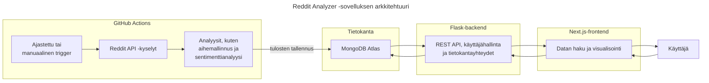

# Seminaarityö: Flask-backendin testausta

Tässä seminaarityössä tutustun Flask-backendin testaukseen osana Ohjelmistoprojekti 2 -kurssin projektiani ([Reddit Analyzer](https://github.com/ohjelmistoprojekti-ii-reddit-app)).

**Sisällysluettelo**:
- [Johdanto](#johdanto)
- [Testauksen perusteet](#testauksen-perusteet)
- [Testaussuunnitelma](#testaussuunnitelma)
- [Testitapaukset](#testitapaukset)
- [Testauksen työkalut](#testauksen-työkalut)
- [Testiympäristön pystytys](#testiympäristön-pystytys)
- [Testien toteutus](#testien-toteutus)
- [Lähteet](#lähteet)
- [Tekoälyn käyttö](#tekoälyn-käyttö-työn-toteutuksessa)


## Johdanto

Valitsin seminaarityöni aiheeksi **testauksen**, koska se on arvostettu taito työelämässä ja ohjelmistokehityksen osa-alue, jossa haluan kehittyä. Aiempi kokemukseni koostuu pääasiassa yksittäisten testien kirjoittamisesta, enkä ole koskaan toteuttanut testausta osana laajempaa kehitysprosessia. Käynnissä oleva **Ohjelmistoprojekti 2** -kurssi tarjoaa tähän erinomaisen mahdollisuuden: olen mukana kehittämässä **Reddit Analyzer** -sovellusta, ja projekti on edennyt jo viimeiseen sprinttiin ilman, että sovellusta olisi vielä testattu lainkaan.

Lähes valmis projekti tarjoaa kiinnostavat ja osin haastavatkin lähtökohdat testaamiselle. Kehityksen loppuvaiheessa ja julkaisun lähestyessä on erityisen tärkeää varmistaa sovelluksen toimivuus ja laatu. Odotan mielenkiinnolla, kuinka testattavaa nykyinen koodi on ja millaisia kehityskohteita testaus tuo esiin.

Minulle tämä seminaarityö on paitsi uusien testausmenetelmien ja -työkalujen opettelua, myös laadullinen tutkimus projektistamme. 

### Projektin tausta

**Reddit Analyzer** on web-sovellus, joka kerää ja analysoi Redditissä käytyjä keskusteluja tunnistaen niistä keskeisiä trendejä ja teemoja sekä keskustelujen sävyjä. Analyysit, kuten aihemallinnus ja sentimenttianalyysi, on toteutettu valmiita malleja (esim. BERTopic, VADER) hyödyntäen, ja ne on automatisoitu **GitHub Actions**in avulla. Tulokset tallennetaan `MongoDB Atlas` -tietokantaan, josta ne tarjoillaan käyttäjälle `Flask`-backendin REST-rajapinnan kautta. `Next.js`-pohjainen frontend esittää analyysien tulokset visuaalisessa muodossa, esimerkiksi kaavioina ja karttanäkymänä.



Arkkitehtuurikaavio havainnollistaa, miten sovelluksen eri osat liittyvät toisiinsa ja mitä niiden vastuualueisiin kuuluu. Analyysiputket on eroteltu omaksi kokonaisuudekseen, koska ne ajetaan **GitHub Actions** -ympäristössä GitHubin virtuaalikoneilla, eivätkä siten kuulu Flask-backendin suoritusympäristöön. Backendin keskeiset osa-alueet ovat **REST-rajapinta, käyttäjähallinta sekä tietokantayhteydet**, kun taas frontend vastaa datan visualisoinnista ja käyttäjän vuorovaikutuksesta sovelluksen kanssa.

Reddit Analyzer on kehitetty viisihenkisessä tiimissä ketterien menetelmien mukaisesti. Oma roolini on painottunut backendin kehitykseen: olen vastannut muun muassa analyysiputkien suunnittelusta ja automatisoinnista sekä tilaustoiminnon toteutuksesta. 

<details>
<summary><strong>Reddit Analyzer -sanastoa</strong></summary>

- **Reddit** - laaja ja tunnettu verkkokeskustelualusta
- **Subreddit** - aihekohtainen keskustelualue Redditissä (esim. [r/Suomi](https://www.reddit.com/r/Suomi/), [r/technology](https://www.reddit.com/r/technology/))
- **Postaus** - käyttäjän julkaisema viesti subredditissä
- **Reddit API** - Redditin tarjoama rajapinta, jonka kautta sovellus hakee Redditistä postauksia ja niiden kommentteja
- **Aihemallinnus** (topic modeling) - NLP-tekniikka, jota käytetään tunnistamaan suurista tekstiaineistoista toistuvia teemoja
- **Sentimenttianalyysi** - NLP-tekniikka, jota käytetään tunnistamaan tekstien sävyä (positiivinen, negatiivinen, neutraali)
- **Analyysiputki** - GitHub Actionsissa ajettava automatisoitu prosessi, joka sisältää postausten haun Reddit APIsta, analyysit, joiden sisältö vaihtelee analyysin tyypistä riippuen (esim. trendianalyysi, tilauskohtainen analyysi), sekä tallennuksen tietokantaan

</details>

### Seminaarityön tavoitteet

Tässä seminaarityössä keskityn **backend-testaukseen**, koska se tarjoaa monipuolisia oppimiskokemuksia ja mahdollisuuden syventyä teknisesti haastaviin osa-alueisiin. **Reddit Analyzerin** backendissa hallinnoidaan muun muassa token-perusteista autentikaatiota ja tietokantayhteyksiä, joiden testaamisesta minulla ei ole aiempaa kokemusta. Myös Python-pohjaisen sovelluksen testaaminen on minulle uutta, mikä tekee aiheesta erityisen opettavaisen.

Tavoitteeni on suunnitella ja toteuttaa testausprosessi selkeästi ja systemaattisesti. **Allure Report** otetaan käyttöön heti alkuvaiheessa, jotta testausprosessin eteneminen ja tulosten analysointi olisi läpinäkyvää ja helposti seurattavaa.

Testauksen automatisointi **GitHub Actions** -ympäristössä on valinnainen lisä: se olisi oppimisen kannalta arvokasta, mutta en pidä sitä välttämättömänä, koska projekti on jo loppusuoralla. Automatisoiduista testeistä olisi ollut eniten hyötyä projektin aikaisemmissa vaiheissa, jolloin ne olisivat toimineet kehityksen jatkuvana tukena. Tässä vaiheessa testauksen ensisijainen tavoite on varmistaa sovelluksen toimivuus ja vakaus ennen julkaisua.

Seminaarityössä keskityn seuraaviin osa-alueisiin:
1. Testauksen suunnittelu
2. Testien toteuttaminen
3. Testitulosten visualisointi **Allure Report** -työkalulla
4. Testitulosten analysointi ja hyödyntäminen ohjelmiston laadun arvioinnissa
5. Testauksen automatisointi **GitHub Actions** -ympäristössä (jos aikaa jää)

Näin työ toimii paitsi käytännön oppimiskokemuksena myös osana projektin laadunvarmistusta.

### Suunnitellut teknologiat

- **Flask** - kevyt Python-pohjainen web-kehys, jota on käytetty Reddit Analyzerin backendin toteutukseen
- **Pytest** - Pythonin suosittu testauskehys, joka tukee yksikkö-, integraatio- ja järjestelmätason testejä
- **Mongomock** - kirjasto, joka simuloi MongoDB:n toimintaa ja mahdollistaa tietokantaoperaatioiden testaamisen ilman oikeaa tietokantayhteyttä
- **GitHub Actions** - GitHubin sisäänrakennettu CI/CD-ympäristö, jonka avulla testit ja muut työnkulut voidaan ajaa automaattisesti koodimuutosten yhteydessä tai esimerkiksi ajastettuna
- **Allure Report** - työkalu, joka visualisoi testitulokset vuorovaikutteisena HTML-sivuna ja tarjoaa kokonaiskuvan testien tuloksista, kattavuudesta ja kehityksestä ajan myötä

<p align="right"><a href="#seminaarityö-flask-backendin-testausta">⬆️</a></p>


## Testauksen perusteet

ℹ️ Hahmottaakseni testien suunnittelua paremmin, kertasin hieman testauksen teoriaa. Jos haluatte painottaa arvioinnissa enemmän teknistä toteutusta, tätä osiota ei ole pakko sisällyttää mukaan.

<details>
<summary><strong>Katso teoriaosio</strong></summary>

Ennen testauksen suunnittelua haluan kerrata lyhyesti keskeiset testauksen periaatteet ja käsitteet. Teoriapohjana hyödynnän Jussi Pekka Kasurisen kirjaa *Ohjelmistotestauksen käsikirja*, johon tutustuin Haaga-Helian Ohjelmistotestauksen kurssilla tänä syksynä.

### Testauksen merkitys

Testaus on keskeinen osa ohjelmistokehitystä, ja sen tarkoituksena on varmistaa, että ohjelmisto **toimii suunnitellusti** ja **täyttää** käyttäjien sekä sidosryhmien **vaatimukset**. Testauksen avulla voidaan havaita vikoja ja puutteita, jotka muuten saattaisivat johtaa ohjelmiston epätoivottuun toimintaan. (Kasurinen, luku 1)

### Testauksen tasot ja menetelmät

Kasurisen kirjan mukaan testauksessa on useita tasoja ja menetelmiä, jotka kattavat ohjelmiston eri osa-alueita ja tarjoavat laadunvarmistukseen eri näkökulmia. Testauksen tasoja kuvataan kirjan sivuilla 50-57 ja menetelmiä sivuilla 64-68.

**Yksikkötestaus** kohdistuu yksittäisen moduulin, funktion tai olion toiminnan varmentamiseen. Testeillä voidaan tarkistaa esimerkiksi erilaisten syötteiden käsittely, raja-arvot ja poikkeustilanteiden hallinta.

**Integraatiotestaus** tarkastelee ohjelmiston eri osien yhteistoimintaa. Sen avulla varmistetaan, että eri moduulit ja rajapinnat kommunikoivat oikein keskenään.

**Järjestelmätestaus** kohdistuu koko järjestelmään, ja sen tarkoituksena on varmistaa, että ohjelmisto toimii kokonaisuutena ja täyttää sille asetetut vaatimukset.

**Mustalaatikkotestaus** on menetelmä, jossa ohjelmistoa arvioidaan sen ulkoisen käyttäytymisen, eli syötteiden ja niistä tuotettujen tulosten perusteella. Testaajalla ei ole tietoa ohjelmiston sisäisestä toteutuksesta.

**Lasilaatikkotestaus** on menetelmä, jossa testaus perustuu ohjelmiston sisäisen rakenteen ja logiikan tuntemiseen. Testaaja suunnittelee testit syötteiden lisäksi myös sen perusteella, miten ohjelmisto on toteutettu ja mitä sen sisällä tapahtuu.

### Testauksen suunnittelu

Kasurisen kirjassa (s. 117-118) kuvataan esimerkkinä **SPACE DIRT** -menetelmän mukaisen **testaussuunnitelman** vaiheet:
- **S**cope - laajuus: mitä kohteita testataan ja mitä osia ei testata
- **P**eople - ihmiset: millaista koulutusta testaajilta vaaditaan, mitkä ovat testaajien vastuut
- **A**pproach - lähestymistapa: mitä testausmenetelmiä käytetään
- **C**riteria - kriteerit: mitkä ovat testauksen aloitus-, lopetus-, keskeytys- ja jatkamiskriteerit
- **E**nvironment - ympäristö: millainen testiympäristö testausta varten tulee rakentaa
- **D**eliverables - tuotokset: mitä testausprosessi tuottaa kehitysprosessin käyttöön
- **I**ncidentals - satunnaiset: mitä erikoisominaisuuksia tai poikkeuksia testaukseen liittyy
- **R**isks - riskit: riskit ja niiden torjunta
- **T**asks - tehtävät: tehtävät, jotka kuuluvat testausprosessiin

Testaussuunnitelman sisältö voi vaihdella projektin ja tilanteen mukaan, joten SPACE DIRT on vain yksi esimerkki. SPACE DIRT ja muut standardien mukaiset testaussuunnitelman sopivat kenties parhaiten suuriin projekteihin - pienemmässä projektissa niitä voi soveltaa poimimalla mukaan oman projektin kannalta keskeiset osa-alueet. Yleensä testaussuunnitelmassa kirjataan ainakin mitä ohjelmasta testataan, missä vaiheessa ja millä menetelmällä (Kasurinen, s.116).

### Testitapausten suunnittelu

Testaussuunnitelman jälkeen suunnitellaan **testitapaukset**, jotka kuvaavat yksittäisiä työvaiheita tai tapahtumaketjuja, joiden seurauksena järjestelmä suorittaa jonkin tehtävän. Kuvauksessa voidaan mainita esimerkiksi testin vaiheet ja odotettu lopputulos ja mitä testillä halutaan varmistaa.

Hyvien käytäntöjen mukaan testitapauksia tulisi määritellä koko projektin elinkaaren ajan, aina kun tulee uusia ominaisuuksia tai kun havaitaan jokin vika tai ongelma. Testitapaukset kannattaa kohdistaa tunnetusti virhealttiisiin ohjelmiston osiin, kuten uuteen koodiin, ominaisuuteen tai teknologiaan. Testitapauksia voi syntyä paljon, jolloin niitä joudutaan priorisoimaan esimerkiksi **riskikartoituksen** avulla. (Kasurinen, s. 118-121)

Kasurisen (s. 122-123) mukaan testitapausten valintaan on kaksi päämenetelmää:
- **Suunnitelmalähtöinen testitapausten valinta**: pyritään kattamaan kaikki ohjelmistolle asetetut laatuvaatimukset mahdollisimman kustannustehokkaasti
- **Riskilähtöinen testitapausten valinta**: keskitytään poistamaan isoimmat ongelmat ja varmistamaan pääominaisuuksien toiminta

### Projektikohtainen pohdinta

Omassa projektissani vaatimusten täyttymisen todentaminen on osittain haasteellista, koska kunnollista vaatimusmäärittelyä ei ole laadittu. Meillä on vain lista käyttäjätarinoita, jotka olemme purkaneet konkreettisiksi tehtäviksi projektitaulussa. Tämän vuoksi testauksen painopiste on erityisesti sovelluksen keskeisten toimintojen **toimivuuden varmistamisessa ja vikojen löytämisessä**. Samalla testaus toimii välineenä arvioida projektin laatua käytännössä.

Pääpaino tulee olemaan **yksikkö- ja integraatiotesteissä**, koska ne soveltuvat backendin REST-rajapinnan ja tietokantayhteyksien testaamiseen parhaiten. Järjestelmätestaus, ainakin Kasurisen kirjan määritelmän mukaisesti, olisi vaikea toteuttaa puutteellisten vaatimusmäärittelyjen sekä rajallisten resurssien vuoksi.

Projektin kokoon ja aikatauluun nähden täysimittainen SPACE DIRT -testaussuunnitelma olisi ylimitoitettu. Käytän sitä kuitenkin inspiraationa oman, kevyemmän testaussuunnitelman laatimisessa, joka keskittyy sovelluksen tärkeimpiin osiin ja riskilähtöiseen priorisointiin. Näin pystyn yhdistämään teorian ja käytännön tarpeet, ja testausprosessi pysyy selkeänä ja johdonmukaisena.

</details>

<p align="right"><a href="#seminaarityö-flask-backendin-testausta">⬆️</a></p>


## Testaussuunnitelma

ℹ️ Jotta testausprosessi olisi mahdollisimman hallittu ja tehokas, laadin melko kattavan testaussuunnitelman. Jos haluatte painottaa arvioinnissa enemmän teknistä toteutusta, tätä osiota ei ole pakko sisällyttää mukaan. Osion lukeminen auttaa kuitenkin hahmottamaan työn tulevia osioita, kuten testitapausten suunnittelua. *Testattavat osa-alueet* -osio auttaa lisäksi ymmärtämään Reddit Analyzerin toimintaa.

<details>
<summary><strong>Katso testaussuunnitelma</strong></summary>

Testaussuunnitelma pohjautuu Kasurisen kuvaamiin testauksen periaatteisiin ja SPACE DIRT -malliin, jota on kevennetty Reddit Analyzer -projektiin sopivaksi.

### Testauksen tavoite ja laajuus

Testauksen tavoitteena on varmistaa Reddit Analyzerin backendin **keskeisten toimintojen toimivuus ja vakaus** ennen julkaisua. Lisäksi testit tukevat projektin **laadun arviointia**, esimerkiksi sovelluksen luotettavuuden ja mahdollisten vikojen kartoittamista, sekä paljastavat ratkaisujen **vahvuuksia ja puutteita**.

Testauksen kohteena ovat:
- **Tietokantayhteydet (MongoDB)** - CRUD-operaatiot
- **REST API** - vasteet, virheidenkäsittely ja raja-arvot
- **Token-pohjainen käyttäjähallinta ja autentikointi** - rekisteröinti, kirjautuminen ja tokenien validointi

Testaus **ei kata** analyysiputkia, koska ne ajetaan erillisessä automatisoidussa ympäristössä (*GitHub Actions*) eivätkä siten kuulu backendin suoritusympäristöön. Tämän vuoksi myös ulkoiset palvelut, kuten Reddit API, sekä analyyseissa käytettävät kirjastot (esim. BERTopic) jäävät testien ulkopuolelle. GitHub Actions tarjoaa kuitenkin työnkuluista suoraa palautetta lokeissa, mikä helpottaa analyysien toimivuuden seurantaa.

Frontendin testaus ei kuulu tämän suunnitelman piiriin, sillä se on toisen tiimin jäsenen vastuulla.

### Testauksen lähestymistapa

Testauksessa noudatetaan **"testit ensin, refaktorointi jälkeen"** -periaatetta: testit kirjoitetaan ensin kaikille keskeisille toiminnoille, vaikka ne aluksi epäonnistuisivat, ja korjaukset toteutetaan lopuksi testien ohjaamana. Toiveena on, että tämä lähestymistapa auttaisi antamaan selkeän kuvan sovelluksen ongelmakohdista. Mikäli lähestymistapa osoittautuu liian haastavaksi tai aikaa vieväksi, voidaan siirtyä perinteisempään menetelmään, jossa refaktorointi ja testaus tehdään rinnakkain.

Koska vaatimusmäärittelymme on vajavaista eikä esimerkiksi hyväksymiskriteerejä ole määritelty, suunnittelen testit pääasiassa sen perusteella, mitä ajattelen sovelluksen toimintojen **kuuluvan** tehdä. Tämä tukee testauksen päätavoitetta, eli sovelluksen kriittisten osien toimivuuden ja vakauden varmistamista. Testitapausten ja testien suunnittelussa hyödynnetään **lasilaatikkomenetelmää**, eli testejä suunnitellaan tarkastelemalla suoraan testattavien funktioiden rakennetta ja logiikkaa.

Testauksessa hyödynnetään **pytest**iä yksikkö- ja integraatiotestien toteutukseen sekä **Allure Report**ia testitulosten visualisointiin. **Mongomock**ia käytetään tietokantatoimintojen simuloimiseen, jotta testit voidaan suorittaa ilman vaikutusta tuotantotietokantaan. Yksikkötesteillä varmistetaan yksittäisten funktioiden ja metodien toiminta, ja integraatiotesteillä testataan eri komponenttien, kuten REST API:n ja tietokannan, yhteistoimintaa.

### Testattavat osa-alueet

#### REST API ja käyttäjähallinta

REST APIn kautta hallinnoidaan kaikkia Reddit Analyzerin keskeisiä toimintoja, jotka ovat trendianalyysi, maakohtainen subreddit-analyysi, tilauspohjainen subreddit-analyysi sekä käyttäjähallinta. **Analyysit suoritetaan automatisoidusti Actionsin kautta**, ja niiden kohdalla rajapintaa käytetään lähinnä analyysitulosten välittämiseen. Tässä lyhyt kuvaus keskeisistä toiminnoista ja niiden yhteydestä rajapintaan:
- **Trendianalyysi**: suuresta määrästä Reddit-postauksia tunnistetaan trendaavia aiheita aihemallinnuksen avulla; sitten tehdään aihekohtaiset tiivistelmät kielimallin avulla, sekä aihekohtainen sentimenttianalyysi. Rajapinnan kautta tarjoillaan subredditit, joille analyyseja säännöllisesti suoritetaan, sekä näiden analyysien tuloksia ja tilastotietoja.
- **Maakohtainen subreddit-analyysi**: pieni määrä maakohtaisia Reddit-postauksia käsitellään kielenkäännöksellä (tarvittaessa) ja sentimenttianalyysilla. Rajapinnan kautta tarjoillaan maakohtaiset subredditit, joille analyyseja säännöllisesti suoritetaan, sekä näiden analyysien tuloksia.
- **Käyttäjähallinta**: Käyttäjähallinnassa hallinnoidaan rekisteröitymistä, kirjautumista ja uloskirjautumista rajapinnan kautta. Käyttäjän autentikointiin käytetään access- ja refresh-tokeneita: access-tokenilla pääsee tekemään rajapintapyynnöt, ja refresh-tokenilla voi tarvittaessa uusia access-tokenin. Logout poistaa käytössä olevan access-tokenin ja merkitsee refresh-tokenin mitätöidyksi.
- **Tilauspohjainen subreddit-analyysi**: käyttäjä voi tilata analyysit haluamaansa subredditiin, haluamallaan analyysityypillä (*posts* tai *topics*), ja tilausten pohjalta suoritetaan analyysit säännöllisesti Actionsin kautta. Rajapinnan kautta suoritetaan toimintoja kuten tilauksen lisäys, deaktivointi, ja tilauskohtaisten analyysitulosten haku.

| Toiminto | Endpoint | Metodi | Kuvaus |
| -------- | -------- | ------ | ------ |
| Trendianalyysi | `/api/subreddits` | GET | Hakee listan subredditeistä, joita analysoidaan automatisoidussa putkessa säännöllisesti | 
| Trendianalyysi | `/api/topics/latest/<subreddit>` | GET | Hakee tuoreimman analyysin tulokset valitulle subredditille | 
| Trendianalyysi | `/api/statistics/<subreddit>/<days>` | GET | Hakee tilastot analysoitujen postausten määristä valitulla aikavälillä |
| Trendianalyysi | `/api/statistics/topics/<subreddit>/<days>/<limit>` | GET | Hakee tilastot useimmiten esiintyvistä aiheista valitulla aikavälillä | 
| Maakohtainen analyysi | `/api/subreddits/countries` | GET | Hakee listan maakohtaisista subredditeistä, joita analysoidaan automatisoidussa putkessa säännöllisesti | 
| Maakohtainen analyysi | `/api/countries/latest/<subreddit>` | GET | Hakee tuoreimman analyysin tulokset valitulle maakohtaiselle subredditille |
| Käyttäjähallinta | `/api/authentication/register` | POST | Luo uuden käyttäjätunnuksen | 
| Käyttäjähallinta | `/api/authentication/login` | POST | Autentikoi käyttäjän ja palauttaa access- ja refresh-tokenit |
| Käyttäjähallinta | `/api/authentication/refresh` | POST | Vaihtaa refresh-tokenin uudeksi access-tokeniksi | 
| Käyttäjähallinta | `/api/authentication/logout` | DELETE | Peruu access-tokenin ja revokoi refresh-tokenin (kirjaa käyttäjän ulos) |
| Käyttäjähallinta | `/api/authentication/delete` | DELETE | Poistaa käyttäjätunnuksen sekä siihen liittyvät mahdolliset aktiiviset tilaukset |
| Tilaustoiminto | `/api/subscriptions/type/<type>` | GET | Hakee aktiiviset tilaukset analyysityypin mukaan | 
| Tilaustoiminto | `/api/subscriptions/current-user` | GET | Hakee aktiiviset tilaukset nykyiselle käyttäjälle | 
| Tilaustoiminto | `/api/subscriptions/current-user/add/<subreddit>/<type>` | POST | Luo tilauksen nykyiselle käyttäjälle valitulla subredditillä ja analyysityypillä |
| Tilaustoiminto | `/api/subscriptions/current-user/deactivate` | PATCH | Deaktivoi nykyisen käyttäjän tilauksen |
| Tilaustoiminto | `/api/subscriptions/current-user/latest-analyzed` | GET | Hakee tuoreimmat analyysitulokset nykyisen käyttäjän tilaukselle |

Olen ylemmästä listauksesta jättänyt pois kaksi endpointia, jotka hakevat ja analysoivat Reddit-dataa reaaliajassa, sillä en aio suorittaa niille testausta; ne toimivat lähinnä demotarkoituksessa, eikä niitä käytetä frontendin puolelta.

Tarkka kuvaus kaikista endpointeista, sisältäen mm. esimerkkipyynnöt ja -vastaukset, löytyy Reddit Analyzerin backendin [dokumentaatiosta](https://github.com/ohjelmistoprojekti-ii-reddit-app/reddit-app-backend?tab=readme-ov-file#-rest-api).

#### Tietokanta

Reddit Analyzerin tietokanta on toteutettu [MongoDB Atlas](https://www.mongodb.com/docs/atlas/) -palvelussa, joka mahdollistaa tietokannan hallinnoinnin kätevästi web-käyttöliittymän kautta. MongoDB on NoSQL-dokumenttitietokanta, jossa data tallennetaan JSON-muotoisiin dokumentteihin. Dokumenttien data organisoidaan *kokoelmiin* (eng. collection), jotka vastaavat relaatiotietokannan *tauluja*. Dokumenttitietokannassa data voi olla monimuotoista, koska skeemat eivät ole pakollisia. MongoDB:stä voi lukea lisää esimerkiksi [täältä](https://www.mongodb.com/docs/manual/introduction/).

Reddit Analyzerin tietokanta sisältää seuraavat kokoelmat:

| Kokoelma | Sisältö |
| -------- | ------- |
| `posts` | Sisältää trendi- ja sentimenttianalyysien tulokset valikoiduille subredditeille. (Data on järjestetty aihemallinnuksessa tunnistettujen aiheiden mukaan, joten selkeämpi kokoelman nimi voisi olla **topics**.) |
| `countries` | Sisältää maakohtaisten subredditien analyysitulokset. Maakohtaisten subredditien analyysiin sisältyy postausten kääntäminen englanniksi (tarvittaessa) sekä postauskohtainen sentimenttianalyysi. |
| `users` | Sisältää rekisteröityneiden käyttäjien tiedot. |
| `subscriptions` | Sisältää käyttäjien tekemät subreddit-tilaukset ja mm. valitun analyysityypin. | 
| `subscription_data` | Sisältää tilausten pohjalta tuotetut analyysitulokset. Tulosten muoto vaihtelee analyysityypin mukaan: `topics`-analyysi sisältää aihemallinnuksen ja aihekohtaisen sentimenttianalyysin, ja `posts`-analyysi sisältää postauskohtainen sentimenttianalyysin. |

Tietokantayhteyksiä hallitaan backendissa erillisen tietokantakerroksen kautta, joka tarjoaa yleiset funktiot esimerkiksi datan tallennukseen, hakuun ja päivitykseen. Tämä mahdollistaa keskitetyn tietokannan hallinnan ja toivon mukaan helpottaa testien toteutusta. 

On hyvä huomioida, että testaus **ei perustu** tuotantotietokannan dataan, vaan testauksessa käytetään erillistä testitietokantaa (*Mongomock*). Yllä olevan tietokantakuvauksen tarkoitus on auttaa hahmottamaan sovelluksen datavirtoja ja toimintaa.

### Testien priorisointi

Testitapauksia ja testejä priorisoidaan **riskilähtöisesti** niin, että sovelluksen ydintoiminnot varmistetaan ensin, ja vähemmän kriittiset osat testataan myöhemmin. Osa-alueiden prioriteettijärjestys on seuraava:
1. **Tietokantayhteydet**
2. **REST API**
3. **Käyttäjähallinta ja autentikointi**

Tietokanta on sovelluksen kriittisin osa, koska kaikki analysoitu data ja käyttäjätiedot kulkevat sen kautta. Ilman toimivaa tietokantaa sovelluksen ydintoiminnot eivät ole käytettävissä, ja frontend jäisi käytännössä tyhjäksi. REST API on toiseksi tärkein osa, sillä frontendin toiminta ja datan käsittely riippuvat siitä. Käyttäjähallinta tuo sovellukseen lisäominaisuuksia, mutta ei ole käytön kannalta välttämätöntä, joten se on prioriteettilistalla alempana. 

Myös yksittäisille **testitapauksille** annetaan prioriteettiluokitus, kuten **korkea, keskitaso tai matala**, sen mukaan, kuinka tärkeä testi on sovelluksen ydintoimintojen varmistamisen kannalta.

Täten testejä priorisoidaan kahdella tasolla:
1. **Osa-alueen kriittisyys** - määrittää, missä järjestyksessä sovelluksen osia testataan (tietokanta → REST API → käyttäjähallinta)
2. **Testitapausten kriittisyys** - määrittää, missä järjestyksessä testejä suoritetaan saman osa-alueen sisällä (edeten korkeimmasta prioriteetista matalimpaan)

### Testiympäristö

Testit suoritetaan ensisijaisesti **paikallisessa** Pythonin virtuaaliympäristössä. Jos aikataulu sallii, voidaan testien suoritus siirtää automatisoituun GitHub Actions -ympäristöön.

### Testauksen kriteerit

Seuraavat kriteerit ohjaavat testausprosessia ja pitävät sen hallittavana:
- **Aloituskriteerit**: Tarvittavat kirjastot ja riippuvuudet on asennettu, backendin perustoiminnot toimivat paikallisesti, ja testiympäristö on pystytetty.
- **Lopetuskriteerit**: Kaikki yksikkö- ja integraatiotestit on suoritettu ja kriittiset testit on läpäisty. Mahdolliset epäonnistuneet testit on dokumentoitu ja ratkaistu.
- **Keskeytyskriteerit**: Testaus voidaan päättää, jos ilmenee odottamattomia ongelmia, kuten virheitä testiympäristössä, tai jos aika loppuu kesken.

### Testauksen tuotokset

Testauksen tulokset kootaan **Allure Report** -raporttiin, joka tarjoaa visuaalisen yhteenvedon testien kulusta, onnistumisista ja havaitusta virheistä. Raporttia voidaan käyttää apuna testitulosten analysoinnissa ja dokumentoinnissa.

</details>

<p align="right"><a href="#seminaarityö-flask-backendin-testausta">⬆️</a></p>


## Testitapaukset

Seuraavaksi kuvaan keskeiset testitapaukset, jotka pohjautuvat edellä esitettyyn testaussuunnitelmaan. Testitapaukset on ryhmitelty testattavien osa-alueiden mukaan (tietokanta, REST API, käyttäjähallinta). Tavoitteena on suunnitella testitapaukset niin, että ne on helppo jäljittää koodista ja Allure Report -raportista suunnitelmaan. 

Koska vaatimusmäärittelymme on vajavaista eikä esimerkiksi hyväksymiskriteerejä ole määritelty, suunnittelen testitapauksia pääasiassa sen perusteella, mitä ajattelen sovelluksen toimintojen **kuuluvan** tehdä.

### Tietokantatestit

Tietokantatestit tulevat olemaan (todennäköisesti) yksikkötestejä. Tietokantamme data on moninaista, emmekä ole määritelleet skeemoja tai pakollisia arvoja, joten en aio keskittyä validoimaan datan eheyttä. Sen sijaan teen muutamia esimerkkidokumentteja ja -kokoelmia, joita simuloin testitietokannassa, varmistaakseni tietokantafunktioiden toiminnan.

#### TC-01 - Data tallennetaan tietokantaan
**Kuvaus**: Testaa `save_data_to_database(data_to_save, collection)` -funktion toimintaa, varmistaen että data **tallentuu oikein** ja virhetilanteet käsitellään asianmukaisesti.<br>
**Prioriteetti**: korkea

| # | Testivaihe | Tavoite | Syöte tai parametri | Odotettu tulos |
|---|------------|---------|---------------------|----------------|
| 1 | Tallennetaan yksittäinen dokumentti | Varmistaa, että yksittäisen dokumentin tallennus onnistuu | Validi dokumentti | Dokumentti lisätään kokoelmaan |
| 2 | Tallennetaan lista dokumentteja | Varmistaa, että useamman dokumentin tallennus onnistuu | Lista valideja dokumentteja | Kaikki dokumentit lisätään kokoelmaan |
| 3 | Tallennetaan tyhjä dokumenttilista | Varmistaa, että virheenkäsittely toimii | Tyhjä lista | `ValueError` tai vastaava |
| 4 | Tallennetaan väärän tyyppistä dataa | Varmistaa, että virheenkäsittely toimii | Virheellinen datatyyppi, kuten merkkijono | `TypeError` tai vastaava |


#### TC-02 - Data haetaan tietokannasta
**Kuvaus**: Testaa `fetch_data_from_collection(collection, filter=None)` -funktion toimintaa, varmistaen että datan **haku toimii oikein** ja virhetilanteet käsitellään asianmukaisesti.<br>
**Prioriteetti**: korkea

| # | Testivaihe | Tavoite | Syöte tai parametri | Odotettu tulos |
|---|------------|---------|---------------------|----------------|
| 1 | Hae kaikki dokumentit | Varmistaa, että kaikkien dokumenttien haku toimii normaalisti | Ei `filter`-parametria | Kaikki dokumentit palautetaan listana |
| 2 | Hae dokumentit käyttäen filtteriä | Varmistaa, että haku palauttaa suodatetut dokumentit oikein | Validi `filter` | Palauttaa suodatinta vastaavat dokumentit listana | 
| 3 | Hae dokumenttia, jota ei ole olemassa | Varmistaa, että haku palauttaa tyhjän listan, jos dokumenttia ei löydy | Invalidi `filter` (ei vastaa mitään dokumenttia) | Tyhjä lista |
| 4 | Hae dokumenttia virheellisellä filtterillä | Varmistaa, että virheenkäsittely toimii | Invalidi `filter`, esim. merkkijono | `TypeError` |


#### TC-03 - Dokumentin päivittäminen tietokannassa
**Kuvaus**: Testaa `update_one_item_in_collection(collection, filter, update)` -funktion toimintaa, varmistaen että datan **päivitys toimii oikein** ja virhetilanteet käsitellään asianmukaisesti.<br>
**Prioriteetti**: korkea

| # | Testivaihe | Tavoite | Syöte tai parametri | Odotettu tulos |
|---|------------|---------|---------------------|----------------|
| 1 | Päivitä olemassa oleva dokumentti | Varmistaa, että päivitys onnistuu | Validi `filter` ja `update` | Dokumentti päivitetään onnistuneesti | 
| 2 | Päivitä dokumenttia, jota ei ole olemassa | Varmistaa, että virheenkäsittely toimii | Invalidi `filter` (ei vastaa mitään dokumenttia) | `ValueError` tai vastaava |
| 3 | Päivitä dokumenttia virheellisellä filtterillä | Varmistaa, että virheenkäsittely toimii | Invalidi `filter`, esim. merkkijono | `TypeError` tai vastaava |


#### TC-04 - Dokumentin poistaminen tietokannasta
**Kuvaus**: Testaa `delete_one_item_from_collection(collection, filter)`, varmistaen että datan **poisto toimii oikein** ja virhetilanteet käsitellään asianmukaisesti.<br>
**Prioriteetti**: korkea

| # | Testivaihe | Tavoite | Syöte tai parametri | Odotettu tulos |
|---|------------|---------|---------------------|----------------|
| 1 | Poista olemassa oleva dokumentti | Varmistaa, että poisto onnistuu | Validi `filter` (vastaa olemassaolevaa dokumenttia) | Dokumentti poistetaan onnistuneesti |
| 2 | Poista dokumentti, jota ei ole olemassa | Varmistaa, että virheenkäsittely toimii | Invalidi `filter` (ei vastaa mitään dokumenttia) | `ValueError` tai vastaava |
| 3 | Poista dokumentti virheellisellä filtterillä | Varmistaa, että virheenkäsittely toimii | Invalidi `filter`, esim. merkkijono | `TypeError` tai vastaava |


> [!NOTE]
> Seuraavia analyysituloksia käsitteleviä testejä varten täytyy luoda hieman laajempi testidatasetti, joka kattaa erityyppiset analyysitulokset. Dataa täytyy tallettaa myös eri timestampeilla.
>
> Selkeyden vuoksi analyysituloksia käsittelevät testit kannattaa erotella perustoimintoja (kuten tallennus, päivitys) testaavista testeistä omiin tiedostoihinsa.


#### TC-05 - Uusimpien analyysitulosten haku valitulle subredditille
**Kuvaus**: Testaa `get_latest_data_by_subreddit(collection, subreddit, type=None)` -funktion toimintaa, varmistaen että funktio **palauttaa uusimman datan oikein** ja käsittelee virhetilanteet asianmukaisesti.<br>
**Prioriteetti**: korkea<br>

| # | Testivaihe | Tavoite | Syöte tai parametri | Odotettu tulos |
|---|------------|---------|---------------------|----------------|
| 1 | Hae uusimmat dokumentit ilman `type`-filtteriä | Varmistaa, että uusimmat dokumentit palautetaan oikein | Validi `subreddit` (vastaa testidataa) | Palauttaa dokumentin uusimmalla timestampilla |
| 2 | Hae uusimmat dokumentit `type`-filtterin kanssa | Varmistaa, että analyysityypin filtteriöinti toimii | Validi `subreddit` ja `type` (vastaa testidataa) | Palauttaa dokumentin uusimmalla timestampilla ja oikealla analyysityypillä |
| 3 | Hae dokumentteja subredditistä, jota ei ole olemassa | Varmistaa, että olemattomasta subredditistä haku käsitellään oikein | Invalidi `subreddit` | Tyhjä lista | 
| 4 | Hae virheellisellä `type`-parametrilla | Varmistaa, että virheenkäsittely toimii | Invalidi `type`, eli joku muu kuin *posts* tai *topics* | `ValueError` tai vastaava |


#### TC-06 - Postausmäärien laskeminen valitulla aikavälillä
**Kuvaus**: Testaa `get_post_numbers_by_timeperiod(subreddit, number_of_days)` -funktion toimintaa, varmistaen että funktio **laskee postausmäärät oikein** ja virhetilanteet käsitellään asianmukaisesti.<br>
**Prioriteetti**: keskitaso<br>
**Huomio**: Testidataan täytyy lisätä useamman päivän postauksia, jotta aggregointi toimii oikein.

| # | Testivaihe | Tavoite | Syöte tai parametri | Odotettu tulos |
|---|------------|---------|---------------------|----------------|
| 1 | Hae postaukset olemassaolevalle subredditille | Varmistaa, että postausmäärät lasketaan oikein | Validi `subreddit` ja `number_of_days` | Palauttaa listan postausmääristä, ja määrät ovat oikein |
| 2 | Hae postaukset subredditille, jota ei ole olemassa | Varmistaa, että olemattomasta subredditistä haku käsitellään oikein | Invalidi `subreddit` | Tyhjä lista |
| 3 | Hae virheellisellä `number_of_days`-parametrilla | Varmistaa, että virheenkäsittely toimii | Invalidi `number_of_days`, esim. negatiivinen luku | `ValueError` tai vastaava | 


#### TC-07 - Suosituimpien topicien haku valitulla aikavälillä
**Kuvaus**: Testaa `get_top_topics_by_timeperiod(subreddit, number_of_days, limit)` -funktion toimintaa, varmistaen että funktio **palauttaa topicit oikeassa järjestyksessä ja oikeilla määrillä** ja virhetilanteet käsitellään asianmukaisesti.<br>
**Prioriteetti**: keskitaso<br>
**Huomio**: Testidataan täytyy lisätä useamman päivän postauksia, jotta aggregointi toimii oikein.

| # | Testivaihe | Tavoite | Syöte tai parametri | Odotettu tulos |
|---|------------|---------|---------------------|----------------|
| 1 | Hae suosituimmat topicit olemassaolevalle subredditille | Varmistaa, että suosituimmat topicit lasketaan oikein | Validi `subreddit`, `number_of_days` ja `limit` | Palauttaa listan topiceja oikeassa järjestyksessä, topicien määrä == limit |
| 2 | Hae suosituimmat topicit subredditille, jota ei ole olemassa | Varmistaa, että olemattomasta subredditistä haku käsitellään oikein | Invalidi `subreddit` | Tyhjä lista |
| 3 | Hae suurella `limit`-arvolla | Varmistaa, että funktio palauttaa kaikki saatavilla olevat topicit eikä virhettä synny | Validi `subreddit`, suuri `limit` | Palauttaa kaikki suosituimmat topicit, ja määrä < `limit` | 
| 4 | Hae virheellisellä `number_of_days`-parametrilla | Varmistaa, että virheenkäsittely toimii | Invalidi `number_of_days`, esim. negatiivinen luku | `ValueError` tai vastaava |

<p align="right"><a href="#seminaarityö-flask-backendin-testausta">⬆️</a></p>


### REST API- ja käyttäjähallintatestit

REST API -testit toteutetaan testausuunnitelman mukaisessa prioriteettijärjestyksessä. Aluksi varmistetaan sovelluksen perustoiminnot, jotka ovat kaikkien käyttäjien saatavilla ilman kirjautumista. Tämän jälkeen testataan käyttäjähallinta (kuten kirjautuminen ja rekisteröinti), ja lopuksi kirjautumista vaativat toiminnot, varmistaen samalla, että virhetilanteet käsitellään oikein.

*Kaikki endpointit ja niiden tarkemmat kuvaukset on listattu [testaussuunnitelman](#testaussuunnitelma) osiossa "Testattavat osa-alueet".*

### Julkiset toiminnot (ei vaadi kirjautumista)

#### TC-08 - Hae lista subredditeistä
**Kuvaus**: Testaa `/api/subreddits`-endpointin toimintaa varmistaen, että se **palauttaa listan** saatavilla olevista **subredditeistä** ja käsittelee virhetilanteet asianmukaisesti.<br>
**Prioriteetti**: korkea

| # | Testivaihe | Tavoite | Syöte tai parametri | Odotettu tulos |
|---|------------|---------|---------------------|----------------|
| 1 | Hae lista subredditeistä | Varmistaa, että lista palautuu oikein | - | Status `200 OK` ja subredditit listana | 
| 2 | Tarkista listan sisältö | Varmistaa, että subredditit vastaavat config-määrittelyjä | - | Listan subredditit vastaavat `Config.SUBREDDITS` sisältöä |
| 3 | Hae lista subredditeistä, kun config puuttuu | Varmistaa, että virhetilanne käsitellään oikein | Poista `Config.SUBREDDITS` | Status `500 Internal Service Error` tai vastaava | 


#### TC-09 - Hae lista maakohtaisista subredditeistä
**Kuvaus**: Testaa `/api/subreddits/countries`-endpointin toimintaa varmistaen, että se **palauttaa listan** saatavilla olevista **maakohtaisista subredditeistä** ja käsittelee virhetilanteet asianmukaisesti.<br>
**Prioriteetti**: korkea

| # | Testivaihe | Tavoite | Syöte tai parametri | Odotettu tulos |
|---|------------|---------|---------------------|----------------|
| 1 | Hae lista subredditeistä | Varmistaa, että lista palautuu oikein | - | Status `200 OK` ja subredditit listana | 
| 2 | Tarkista listan sisältö | Varmistaa, että subredditit vastaavat config-määrittelyjä | - | Listan subredditit vastaavat `Config.COUNTRY_SUBREDDITS` sisältöä |
| 3 | Hae lista subredditeistä, kun config puuttuu | Varmistaa, että virhetilanne käsitellään oikein | Poista `Config.COUNTRY_SUBREDDITS` | Status `500 Internal Service Error` tai vastaava | 
| 4 | Tarkista kirjautumisen tarve | Varmistaa, että osa subredditeistä on merkitty kirjautumista vaativiksi | - | Jokaisessa listan kohdassa on kenttä `login_required`, joka on 0 tai 1 |


#### TC-10 - Hae trendianalyysin tulokset
**Kuvaus**: Testaa `/api/topics/latest/<subreddit>`-endpointin toimintaa varmistaen, että se **palauttaa uusimmat analyysitulokset** valitulle subredditille ja käsittelee virhetilanteet asianmukaisesti.<br>
**Prioriteetti**: korkea

| # | Testivaihe | Tavoite | Syöte tai parametri | Odotettu tulos |
|---|------------|---------|---------------------|----------------|
| 1 | Hae analyysitulokset olemassaolevalle subredditille | Varmistaa, että endpoint palauttaa uusimmat tulokset oikein | Validi `subreddit` | Palauttaa listana tulokset, joissa on tuorein `timestamp` |
| 2 | Hae analyysitulokset subredditille, jota ei ole olemassa | Varmistaa, että virheenkäsittely toimii | Invalidi `subreddit` | Status `404 Not Found` tai vastaava |
| 3 | Tarkista datan sisältö | Varmistaa, että data vastaa tietokannan sisältöä | Validi `subreddit` | JSON sisältää odotetut kentät (label, posts, subreddit, timestamp jne.) |


#### TC-11 - Hae maakohtaisen analyysin tulokset
**Kuvaus**: Testaa `/api/countries/latest/<subreddit>`-endpointin toimintaa varmistaen, että se **palauttaa uusimmat analyysitulokset** valitulle maakohtaiselle subredditille ja käsittelee virhetilanteet asianmukaisesti.<br>
**Prioriteetti**: korkea

| # | Testivaihe | Tavoite | Syöte tai parametri | Odotettu tulos |
|---|------------|---------|---------------------|----------------|
| 1 | Hae analyysitulokset olemassaolevalle subredditille | Varmistaa, että endpoint palauttaa uusimmat tulokset oikein | Validi `subreddit` | Palauttaa listana tulokset, joissa on tuorein `timestamp` |
| 2 | Hae analyysitulokset subredditille, jota ei ole olemassa | Varmistaa, että virheenkäsittely toimii | Invalidi `subreddit` | Status `404 Not Found` tai vastaava |
| 3 | Tarkista datan sisältö | Varmistaa, että data vastaa tietokannan sisältöä | Validi `subreddit` | JSON sisältää odotetut kentät (country, posts, requiresLogin jne.) |


#### TC-12 - Hae trendianalyysin postausmäärien tilastot
**Kuvaus**: Testaa `/api/statistics/<subreddit>/<days>`-endpointin toimintaa varmistaen, että se **palauttaa postausmäärien tilastot** valitulle subredditille ja käsittelee virhetilanteet asianmukaisesti.<br>
**Prioriteetti**: keskitaso

| # | Testivaihe | Tavoite | Syöte tai parametri | Odotettu tulos |
|---|------------|---------|---------------------|----------------|
| 1 | Hae tilastot olemassaolevalle subredditille | Varmistaa, että endpoint palauttaa tilastot oikein | Validi `subreddit` | Palauttaa tilastot listana |
| 2 | Hae tilastot subredditille, jota ei ole olemassa | Varmistaa, että virheenkäsittely toimii | Invalidi `subreddit` | Status `404 Not Found` tai vastaava |
| 3 | Tarkista datan sisältö | Varmistaa, että sisältö on oikeassa muodossa | Validi `subreddit` | JSON sisältää odotetut kentät (_id, daily (`[{}]`), total_posts) |


#### TC-13 - Hae trendianalyysin tilastot suosituimmille topiceille
**Kuvaus**: Testaa `/api/statistics/topics/<subreddit>/<days>/<limit>`-endpointin toimintaa varmistaen, että se **palauttaa suosituimpien topicien tilastot** valitulle subredditille ja käsittelee virhetilanteet asianmukaisesti.<br>
**Prioriteetti**: keskitaso

| # | Testivaihe | Tavoite | Syöte tai parametri | Odotettu tulos |
|---|------------|---------|---------------------|----------------|
| 1 | Hae tilastot olemassaolevalle subredditille | Varmistaa, että endpoint palauttaa tilastot oikein | Validi `subreddit` | Palauttaa tilastot listana |
| 2 | Hae tilastot subredditille, jota ei ole olemassa | Varmistaa, että virheenkäsittely toimii | Invalidi `subreddit` | Status `404 Not Found` tai vastaava |
| 3 | Tarkista datan sisältö | Varmistaa, että sisältö on oikeassa muodossa | Validi `subreddit` | JSON sisältää odotetut kentät (_id, topics (`[{}]`)) |

> [!NOTE]
> Tässä kohtaa huomasin, että suunniteltuja testejä on jo merkittävä määrä (+40kpl) ja projektia on jäljellä 6 päivää. Jäljellä oleva aikataulu ei realistisesti mahdollista kaikkien testitapausten perusteellista suunnittelua ja toteutusta.
>
> Näen parhaaksi aloittaa tässä vaiheessa testien toteutuksen varmistaakseni, että kriittiset ja prioriteetiltaan tärkeimmät testit ehditään implementoida ennen projektin määräaikaa. Mikäli aikaa jää, palaan täydentämään puuttuvia testitapauksia.

Suunnitellut testitapaukset:
- **Käyttäjähallinta (autentikointi)**
- **Käyttäjän lisäominaisuudet (vaatii kirjautumisen)**

<p align="right"><a href="#seminaarityö-flask-backendin-testausta">⬆️</a></p>

## Testauksen työkalut

Tämä osio sisältää teoriaa ja koodiesimerkkejä työkaluista, joita testien toteuksessa käytetään.

<details>
    <summary><strong>Pytest</strong></summary>

Pytest on Pythonin suosittu testauskehys, jossa testit kirjoitetaan tavallisina funktioina ja testien onnistuminen tarkistetaan `assert`-väitteillä. Pytestin keskeisiä etuja ovat yksinkertainen syntaksi ja vähäinen määrä pakollista "boilerplate" koodia. Pytestin [dokumentaatiossa](https://docs.pytest.org/en/stable/how-to/assert.html) on seuraavia esimerkkejä testien kirjoittamisesta:
```python
def f():
    return 3

def test_function():
    assert f() == 4
```
Tämä testi epäonnistuu, koska `f` palauttaa arvon 3, mutta testissä odotetaan arvoa 4. Jos odotusarvo muutetaan vastaamaan toteutusta, testi menee läpi:
```python
    assert f() == 3
```

Poikkeusten testaaminen onnistuu tähän tyyliin `pytest.raises` -kontekstilla:
```python
def test_zero_division():
    with pytest.raises(ZeroDivisionError):
        1 / 0
```

Pytest löytää testit automaattisesti kaikista tiedostoista, joiden nimi on muodossa `test_*.py` tai `*_test.py`. Testejä voidaan ajaa seuraavilla komennoilla:
- Aja kaikki testit:
```
pytest
```
- Aja testit tietystä tiedostosta:
```
pytest tests/test_module.py
```

Testien valmistelua ja jaettujen resurssien hallintaa varten pytestissa voidaan käyttää **fixture**ja, jotka määritellään `conftest.py`-tiedostossa. Fixturen avulla voidaan luoda esimerkiksi testitietokanta, jota voidaan sitten käyttää testifunktioissa parametrina ilman erillistä importia.

Lähteet:
- [Testien kirjoittaminen ja assertin käyttö](https://docs.pytest.org/en/stable/how-to/assert.html)
- [Testien ajaminen](https://docs.pytest.org/en/stable/getting-started.html#run-multiple-tests)
- Fixturet: [1](https://docs.pytest.org/en/7.4.x/explanation/fixtures.html) & [2](https://flask.palletsprojects.com/en/stable/tutorial/tests/#setup-and-fixtures)
</details>

<details>
    <summary><strong>Allure Report</strong></summary>

Allure Report on työkalu, jonka avulla voidaan esittää testitulokset visuaalisesti interaktiivisen HTML-sivun muodossa. Allure on yhteensopiva monien eri testikehysten, kuten **pytest**in, **Playwright**in ja **Jest**in, kanssa. Raportti näyttää testien statukset, virheet, poikkeukset ja suoritusajat. Testejä voidaan organisoida eri tasoihin tai kategorioihin, ja niille voidaan määritellä esimerkiksi otsikoita, kuvauksia ja kriittisyysaste (*severity*).

> **Ohjeet Alluren käyttöönottoon löytyvät raportin osiosta [Testiympäristön pystytys](#1-allure-reportin-asennus).**

Alluren [dokumentaatiosta](https://allurereport.org/docs/pytest/#writing-tests) löytyy koodiesimerkkejä Alluren käytöstä pytest-ympäristössä. Tämä esimerkki havainnollistaa hyvin, miten paljon erilaista metadataa testeille pystyy lisäämään: 
```python
import allure

@allure.title("Test Authentication")
@allure.description("This test attempts to log into the website using a login and a password. Fails if any error happens.")
@allure.tag("NewUI", "Essentials", "Authentication")
@allure.severity(allure.severity_level.CRITICAL)
@allure.label("owner", "John Doe")
@allure.link("https://dev.example.com/", name="Website")
@allure.issue("AUTH-123")
@allure.testcase("TMS-456")
def test_authentication():
    ...
```

Testasin Allurea omassa projektissani:
```python
@allure.epic("Database tests")
@allure.suite("TC-01: Save data to database")
@allure.sub_suite("Save one item")
def test_save_one_document():
    ...
```

Kuvasta näkyy, miten testi organisoitiin raportissa käyttämieni `@allure`-annotaatioiden mukaisesti:


**Allure Report -raportin luominen**:

- Aja testit ja tallenna tulokset:
```
pytest --alluredir=allure-results
```
- Generoi raportti ja avaa se selaimessa:
```
allure generate allure-results --clean -o allure-report
allure open allure-report
```

**Historiatietojen seuraaminen Allurella**:

Allure Reportin avulla voi seurata testitulosten [historiatietoja](https://allurereport.org/docs/history-and-retries), mutta se ei tapahdu automaattisesti. Allure ei säilytä aiempien testiajojen tuloksia, ellei niitä siirretä talteen. Ideaalitilanteessa siirron voisi automatisoida esimerkiksi GitHub Actionsin kautta, mutta minulla ei ole juuri nyt aikaa perehtyä siihen. Tässä siis ohjeet historiatietojen siirtämiseen käsin:

> Poistot ja kopioinnit voi tehdä komentoriviltä alla olevien ohjeiden mukaan, mutta itse olen usein hoitanut ne suoraan VS Coden käyttöliittymässä, koska se on mielestäni kätevämpää.

1. Luo raportti normaalisti:
```
pytest --alluredir=allure-results
allure generate allure-results --clean -o allure-report
```
**Tarkista**, että `allure-report`-kansioon ilmestyi `history`-kansio.

2. Poista `allure-results`-kansio, jotta uusi data ei sekoitu edellisten ajojen kanssa:
```
rm -r allure-results  # Linux/macOS
del /s /q allure-results  # Windows
```

3. Aja testit uudelleen:
```
pytest --alluredir=allure-results
```

4. Kopioi edellisen ajon historiatiedot `allure-report`-kansiosta `allure-results`-kansioon (**HUOM.** tämä on tehtävä ennen uuden Allure-raportin generointia, muuten edellisen ajon tiedot menetetään):
```
cp -r allure-report/history allure-results/history  # Linux/macOS
xcopy /E /I allure-report\history allure-results\history  # Windows
```

5. Luo uusi raportti ja (halutessasi) avaa se selaimessa:
```
allure generate allure-results -o allure-report
allure open allure-report
```
**Nyt raportin pitäisi näyttää myös edellisen ajon historiatiedot.**

> *HUOM*: Jos unohtaa kopioida historiatiedot jollakin ajokerralla, kyseisen ajon tiedot eivät tule mukaan seuraavaan raporttiin. Aiemmin siirretty historia säilyy, kunhan `history`-kansio kopioidaan `allure-results`-hakemistoon **ENNEN** uuden raportin generointia.

*Ohjeet historiatietojen poistamiseen ja kopioimiseen komentoriviltä generoitu ChatGPT:n avulla*.


Lähteet: 
- [Tulosten visualisointi](https://allurereport.org/docs/visual-analytics/)
- Testiraportin organisointi: [1](https://allurereport.org/docs/gettingstarted-navigation/#improving-navigation-in-your-test-report) & [2](https://allurereport.org/docs/gettingstarted-readability/)
- [Alluren käyttö pytestin kanssa](https://allurereport.org/docs/pytest/#getting-started-with-allure-pytest)
- [Historiatietojen seuraaminen](https://allurereport.org/docs/history-and-retries/#how-to-enable-history)

</details>

<p align="right"><a href="#seminaarityö-flask-backendin-testausta">⬆️</a></p>

## Testiympäristön pystytys

### 1. Allure Reportin asennus
Jotta Allure Reportia voi käyttää projektissa, se täytyy ensin asentaa omalle koneelle. Tämä käy ilmi esim. Allure Reportin [GitHub-sivulta](https://github.com/allure-framework/allure2). Suoritetaan asennus Alluren ohjeiden mukaan Windowsille:
1. Asennetaan [Scoop](https://scoop.sh/) (komentorivin asennusohjelma) PowerShellillä:
```
Set-ExecutionPolicy RemoteSigned -scope CurrentUser
Invoke-RestMethod -Uri https://get.scoop.sh | Invoke-Expression
```
2. Asennetaan Allure Scoopin avulla:
```
scoop install allure
```

### 2. Riippuvuuksien asentaminen
Seuraavaksi asennetaan testauksessa tarvittavat riippuvuudet Reddit Analyzeriin:
```
pip install pytest mongomock allure-pytest
```

- [pytest](https://docs.pytest.org/en/stable/) - Pythonin testikehys
- [mongomock](https://github.com/mongomock/mongomock) - tietokannan mockaukseen
- [allure-pytest](https://allurereport.org/docs/pytest/) - Alluren pytest-laajennos

### 3. Projektin alustaminen testaukselle
Luodaan testeille oma kansio nimeltä **tests** ja alustetaan se konfiguraatiotiedostolla nimeltä `conftest.py`, mukaillen Flaskin [tutoriaalia](https://flask.palletsprojects.com/en/stable/tutorial/tests/). Tiedostossa määritellään *fixturet*, jotka luovat sovelluksen testimoodissa.

Tutoriaalin esimerkki ei suoraan sovi meidän projektiimme, koska `app` luodaan hieman eri tavalla. Siksi joudumme soveltamaan vähän:
```python
@pytest.fixture
def app():
    """ Luo Flask-sovelluksen testauskonfiguraatioilla """
    app = create_app()
    app.config["TESTING"] = True
    app.config["JWT_SECRET_KEY"] = "test-secret"
    yield app

@pytest.fixture
def client(app):
    """ Mahdollistaa HTTP-kutsujen simuloinnin testeissä """
    return app.test_client()
```

Tutoriaalissa on käytössä eri tietokanta (SQlite) ja tietokanta määritellään eri tavalla kuin Reddit Analyzerissa, joten myös testitietokannan alustuksen suhteen täytyy soveltaa.

Reddit Analyzerissa tietokantayhteyttä hoidetaan *service*-kansion *db*-tiedostossa seuraavasti:
```python
def connect_db():
    try:
        uri = os.getenv("ATLAS_CONNECTION_STR")
        if not uri:
            raise ValueError("ATLAS_CONNECTION_STR is not set")
        
        client = MongoClient(uri)
        db = client.reddit
        return client, db
    except Exception as e:
        raise ConnectionError(f"Could not connect to database: {e}")
```
Sitten tätä funktiota kutsutaan tietokantaoperaatioita suorittavista funktiosta tähän tapaan:
```python
def save_data_to_database(data_to_save, collection):
    if not isinstance(data_to_save, (list, dict)):
        raise TypeError("Data to save must be a list or a dictionary")

    """ Yhdistetään tietokantaan apufunktion kautta """
    client, db = connect_db()
    coll = db[collection]

    try:
        if isinstance(data_to_save, list):
            coll.insert_many(data_to_save)
        elif isinstance(data_to_save, dict):
            coll.insert_one(data_to_save)
    except Exception as e:
        raise ConnectionError(f"Database error: {e}")
    finally:
        client.close()
```

Nyt katsoessa näitä funktioita mietin, onko tämä tapa tietokantayhteyden hoitamiseen aivan ideaali. Testauksen kannalta on haastavaa, että jokaisessa tietokantafunktiossa yritetään yhdistää oikeaan tietokantaan. Tästä sain idean, että voisin yrittää korvata `ATLAS_CONNECTION_STR`-arvon jotenkin niin, että yhdistetään oikean tietokannan sijasta testitietokantaan. En löytänyt tästä paljoakaan tietoa netistä, joten päädyin lopulta käyttämään apuna ChatGPT:tä. ChatGPT vinkkasi, että tähän voisi sopia pytestin [monkeypatch](https://docs.pytest.org/en/7.4.x/how-to/monkeypatch.html)-fixture, jonka metodeja voi käyttää **patchaamaan** tai korvaamaan arvoja tai toimintoja testausta varten. Tähän yhteyteen sopii monkeypatchin **setenv**-attribuutti. Lisätään testitietokanta `conftest`-tiedostoon:
```python
@pytest.fixture
def mock_db(monkeypatch):
    monkeypatch.setenv("ATLAS_CONNECTION_STR", "mongodb://mock")
    with mock.patch("app.services.db.MongoClient") as mock_client_class:
        mock_client = mongomock.MongoClient()
        mock_client_class.return_value = mock_client
        client, db = connect_db()
        yield client, db
```
Tässä siis korvataan `ATLAS_CONNECTION_STR` testaus-URIlla, ja `MongoClient` patchataan käyttämään `mongomock`-instanssia. Näin kaikki tietokantayhteydet testien aikana ohjautuvat testitietokantaan, eikä oikeaa tuotantotietokantaa käytetä vahingossa.

Jatkossa fixtureja voidaan hyödyntää testauksessa niin, että resurssi välitetään testifunktiolle funktion parametrina. Tässä on Flaskin [tutoriaalista](https://flask.palletsprojects.com/en/stable/tutorial/tests/#factory) esimerkki, jossa simuloidaan REST APIn toimintaa. Client-fixture välitetään funktion parametrina:
```python
def test_hello(client):
    response = client.get('/hello')
    assert response.data == b'Hello, World!'
```

<p align="right"><a href="#seminaarityö-flask-backendin-testausta">⬆️</a></p>


## Testien toteutus

Olen suunnitellut 13 testitapausta, ja jos jokainen testivaihe vastaa yhtä testiä, niin testejä on tulossa yli 40 kappaletta. En näe tarpeelliseksi eritellä jokaisen testin toteutusta yksityiskohtaisesti tässä työssä. Valitsen 2-3 testitapausta per testauksen osa-alue, ja selitän niiden ratkaisut tarkemmin. Kaikki toteutetut testit ovat kuitenkin nähtävissä projektin [tests](https://github.com/ohjelmistoprojekti-ii-reddit-app/reddit-app-backend/tree/testing/tests)-kansiossa.

<p align="right"><a href="#seminaarityö-flask-backendin-testausta">⬆️</a></p>


## Lähteet
- https://flask.palletsprojects.com/en/stable/testing/
- https://dev.to/reritom/unit-testing-pymongo-flask-applications-with-mongomock-and-patches-1m23
- https://flask.palletsprojects.com/en/stable/tutorial/tests/
- https://www.mongodb.com/docs/atlas/
- https://docs.pytest.org/en/stable/
- https://github.com/mongomock/mongomock
- https://docs.github.com/en/actions
- https://allurereport.org/docs/
- Kasurinen, J. 2013. Ohjelmistotestauksen käsikirja. 1. painos. Docendo. Jyväskylä.


## Tekoälyn käyttö työn toteutuksessa

Olen hyödyntänyt tekoälyä, kuten ChatGPT:tä, tekstien muotoilun apuna. Kirjoitan ensin kappaleen itse ja tarvittaessa pyydän tekoälyä ehdottamaan vaihtoehtoisia muotoiluja, joista sitten yhdistän osia omaan tekstiini. Sisällön olen kuitenkin tuottanut itse, enkä käytä tekoälyä tekstin suoraan generointiin.

Käytin tekoälyä apuna myös testiympäristön suunnittelussa ja pystyttämisessä, eli esim. mitä kirjastoja täytyy ladata ja miten alustaa sovellus testausta varten. Minun oli vaikea aluksi ymmärtää, miten pytestin fixtureja käytetään Flask-sovelluksen käynnistämiseen testaustilassa, ja tekoäly oli hyvä apu tässä. Tekoäly auttoi myös pääsemään alkuun mongomockin kanssa.
